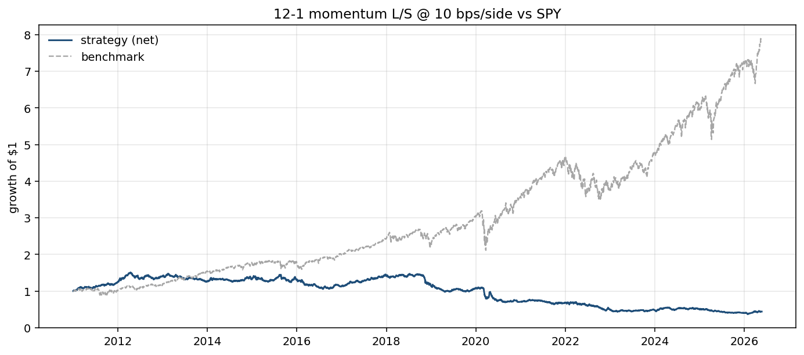
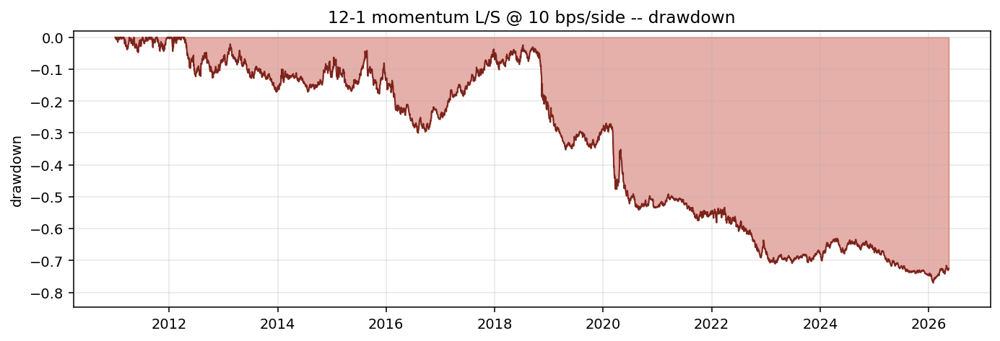
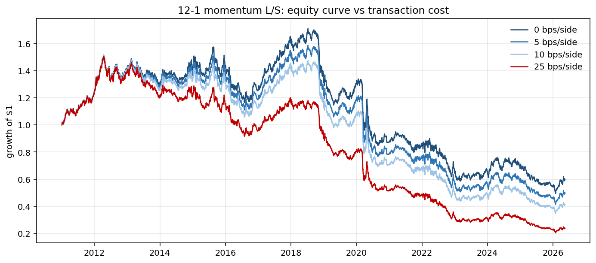

# Phase 3: Does 12-1 Cross-Sectional Momentum Work on Energy ETFs?

> _Snapshot: numbers in this report were computed when written. Since OOS data accumulates daily and yfinance/CFTC/EIA refresh, re-running may produce slightly different point estimates. The **qualitative findings are stable**; the **canonical headline numbers** are in [`FINAL.md`](./FINAL.md), which is regenerated end-to-end._

**TL;DR.** No. In-sample (2011-2018) shows a weak positive Sharpe of 0.20, but out-of-sample (2019-2026-05) the strategy delivers Sharpe -0.70 with a 70% drawdown. The signal does not generalize. This is informative: it tells us pure price-trend signals are unlikely to be the differentiator in this universe, and motivates the curve / inventory / positioning signals planned for Phases 5-6.

## Hypothesis

The "12-1 momentum" effect (long top decile by trailing 12-month return excluding the most recent month, short bottom decile) is one of the most-cited cross-sectional anomalies in equities and futures. The intuition: when an asset has outperformed its peers over a year-long window, market participants under-react and the outperformance continues for some period. The 1-month skip avoids contamination from short-term reversal.

If this effect holds in energy commodities, we should observe:
1. Positive Sharpe in the in-sample window.
2. Positive Sharpe in the out-of-sample window (the headline test).
3. Roughly stable performance across the two — not regime-dependent.
4. The signal should survive realistic transaction costs.

## Methodology

| Choice | Value | Rationale |
|---|---|---|
| Universe | USO, BNO, UNG, UGA, DBE | Energy ETFs as futures proxies. UHN dropped (delisted 2018, would distort the OOS window). |
| Signal | `momentum(adj_close, lookback=252, skip=21)` | Canonical 12-1 in daily approximation. |
| Portfolio | Long top 40%, short bottom 40%, dollar-neutral, equal-weighted within each leg | With 5 assets this yields 2 longs + 2 shorts each day. Coarse but the only sensible choice with such a small cross-section. |
| Rebalance | Daily | The engine recomputes weights every day; turnover is determined by how stable the score's rankings are. |
| Cost model | Linear, 0 / 5 / 10 / 25 bps per side | 10 bps used as headline. |
| Engine | `statarb.backtest.Backtester` | Enforces one-day lag between signal day and trade day. Regression-tested to exactly match raw cumulative returns for constant positions. |
| Walk-forward | IS through 2018-12-31; OOS 2019-01-01 onward | Standard split. Reported separately to surface any regime dependence. |
| Backtest start | 2011-01-03 | First day at least 4 of 5 assets have a defined 12-1 momentum score (BNO's inception is mid-2010). |
| Benchmark | SPY daily returns | Beta and alpha computed via OLS. |

## Headline results

Strategy at **10 bps per side**, evaluated separately on each window:

| Window | Days | CAGR | Ann vol | Sharpe | Sortino | MaxDD | DD days | Hit (mo) | Turnover/yr | Beta vs SPY | Alpha vs SPY (ann) |
|---|---:|---:|---:|---:|---:|---:|---:|---:|---:|---:|---:|
| In-sample (2011-2018) | 2,012 | +1.68% | 11.87% | **+0.20** | +0.28 | -29.98% | ~1,300 | 53.1% | 18.9x | 0.02 | +2.18% |
| **Out-of-sample (2019-)** | 1,853 | **-12.86%** | 17.38% | **-0.70** | -0.95 | **-70.47%** | ~1,200 | 47.4% | 18.9x | 0.05 | -13.16% |
| Full window | 3,865 | -5.57% | 14.78% | -0.31 | -0.43 | -76.99% | ~1,900 | 49.6% | 24.0x | 0.04 | -5.19% |

### Cost sensitivity (full window)

| Cost (bps/side) | Sharpe | CAGR | MaxDD |
|---:|---:|---:|---:|
| 0 | -0.15 | -3.28% | -71.07% |
| 5 | -0.23 | -4.43% | -73.88% |
| 10 | -0.31 | -5.57% | -76.99% |
| 25 | -0.56 | -8.91% | -86.39% |

Notice that **even at zero cost the signal is unprofitable across the full window**. Costs are an aggravator, not the cause. A "kill it with realistic costs" strategy can sometimes be rescued by frequency reduction or smarter portfolio construction; this one cannot.





## What this tells us

### The signal does not transfer from IS to OOS
The IS Sharpe of 0.20 isn't strong enough to be confident in by itself (a t-stat of ~0.9 over 8 years), and the OOS Sharpe of -0.70 dispatches any doubt. If this were a real trading strategy under consideration, the IS result would not have been enough to deploy — and that's exactly what walk-forward discipline is for.

### Why this happened — three plausible explanations
1. **Small cross-section.** Ranking 5 assets each day into "top 40% / bottom 40%" gives a 2-vs-2 portfolio. The score gap between rank 2 and rank 3 is often tiny and dominated by noise. Cross-sectional momentum was developed for universes of hundreds of stocks, where the gap between rank 10 and rank 200 is large and meaningful.
2. **ETF mechanical drag is dwarfing any signal.** USO and UNG bleed against actual futures returns due to contango on monthly rolls. A naive momentum signal computed on these ETFs can pick up the bleed pattern itself rather than commodity-price momentum — and that pattern is unhelpful for long/short selection.
3. **Energy regime shift after 2018.** The 2020 oil price collapse (and brief negative WTI print) and the 2022 Russia/Ukraine supply shock both produced sharp trend reversals. A trend-following signal is structurally vulnerable to these.

The honest answer is probably "all three", with (1) and (2) likely the dominant culprits.

### What I am NOT concluding
- "Momentum doesn't work." That would be too strong. Momentum has decades of evidence in larger universes. The conclusion here is "this particular implementation, on this particular small ETF-proxy universe, does not work."
- "Energy commodities have no trend." Likely false. Real continuous-futures series (Phase 5) may show different behavior than ETF proxies.

## What I'm taking forward

1. **Phase 4 (reversal) will probably also struggle in isolation.** The same small-cross-section, ETF-proxy issues apply. I'll run it for completeness and for the signal-combination exercise, but I'm not expecting it to be a savior.
2. **Phase 5 (futures + carry) is now mission-critical.** The signals that *aren't* pure price patterns — curve carry, inventory shocks, COT positioning — are the project's actual hypothesis. The Phase 3 null result strengthens the case that those signals are where the differentiation lives.
3. **The pipeline is validated.** The engine, evaluation suite, walk-forward split, and cost-sensitivity machinery all worked correctly. Future signals plug in trivially.
4. **The contango bleed I noted as a smoke-test finding in Phase 2 is reaffirmed here.** It's not just a curiosity; it's plausibly distorting any price-based signal on this universe.

## Limitations and honesty notes

- **Universe is tiny.** Five assets is barely a "cross-section". This is the project's biggest structural limitation until Phase 5 brings in real futures.
- **ETF proxies are not the underlying commodity.** USO holds front-month and second-month WTI futures, rolled monthly. UNG is even worse — its contango decay is well-documented and aggressive. The actual price series being signal-on is partially synthetic.
- **Daily rebalance generates high turnover.** Even at 24x annualized turnover and 10 bps per side, costs subtract ~2.3% per year. A monthly rebalance variant would cut this materially; I haven't tested it yet.
- **No parameter search.** I used the textbook 12-1 specification. There may be a (lookback, skip) combo that looks better in IS — but using IS to find it and then reporting OOS would conflate signal quality with overfitting headroom. The textbook spec is the honest baseline.
- **`hit/d` of ~51% is misleading on its own.** Because the engine's day-zero P&L is 0 by lag convention, including the zero days in the daily hit rate would pull every strategy toward 50%. The numbers reported above use only non-zero days. Monthly hit rate, which is less biased, agrees that the strategy is roughly coin-flip in-sample and worse OOS.

## Reproducibility

```bash
uv run python scripts/run_momentum.py
```

Outputs:
- `reports/charts/01_momentum_*.png` (this report's three figures)
- `reports/01_momentum_metrics.csv` (the metrics table above, with more digits)

All numbers in this report come from that script. The script imports only `statarb.*` and reads `data/processed/adj_close.parquet`, which was produced by `uv run python -m statarb.cli.ingest`.
