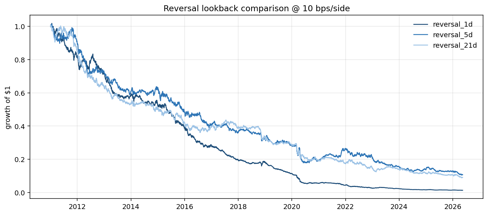
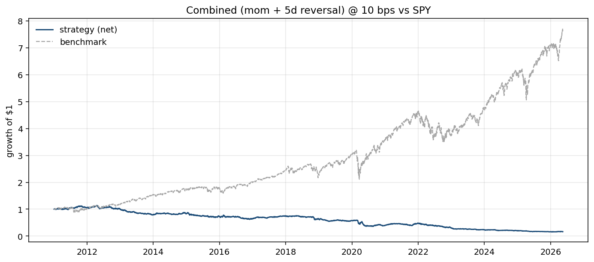
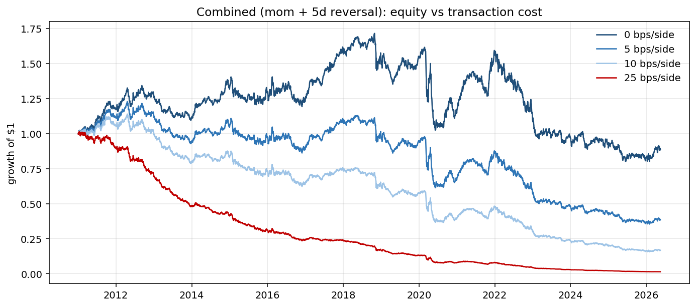
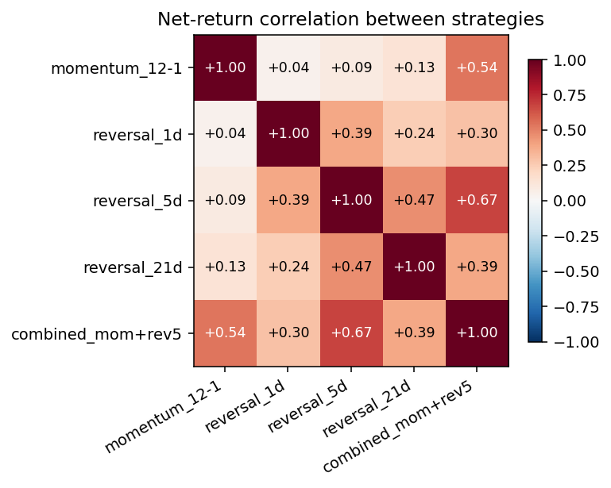

# Phase 4: Short-Term Reversal, Alone and Combined with Momentum

**TL;DR.** None of the reversal lookbacks (1d, 5d, 21d) is profitable. Combining 5-day reversal with 12-1 momentum *does* produce two genuinely independent signals (Pearson correlation 0.09) — but since neither has positive alpha, the combination has Sharpe ≈ 0 at zero cost and bleeds out from transaction costs at any realistic level. The combination machinery is validated; the input signals are not.

## Hypothesis

The reversal hypothesis: short-term price moves (1-21 days) are often driven by liquidity shocks, news overreactions, or fast-money positioning rather than information, and tend to partially mean-revert. A "long the recent losers, short the recent winners" strategy should capture this.

For the combination: if reversal and momentum capture different mispricings, they should be near-uncorrelated. Combining two uncorrelated positive-Sharpe signals would compound the diversification benefit and yield a higher Sharpe than either alone. The walk-forward test for this question is straightforward: does combined Sharpe > average of the two standalone Sharpes?

## Methodology

| Choice | Value |
|---|---|
| Universe | USO, BNO, UNG, UGA, DBE (UHN dropped) |
| Momentum signal | `momentum(adj_close, lookback=252, skip=21)` |
| Reversal signal | `reversal(adj_close, lookback=N)` for N ∈ {1, 5, 21}. Headline: 5-day. |
| Combination | z-score each signal cross-sectionally per day, equal-weight average |
| Portfolio | Long top 40%, short bottom 40%, dollar-neutral, equal-weighted |
| Costs | 0 / 5 / 10 / 25 bps per side. Headline: 10 bps. |
| Windows | IS through 2018-12-31, OOS 2019-01-01 onward |
| Engine | `statarb.backtest.Backtester` (single one-day lag enforced) |

All numbers from `uv run python scripts/run_reversal_and_combo.py`. See `reports/02_reversal_and_combo_metrics.csv` for the unrounded table.

## Standalone results (full window, 10 bps/side)

| Strategy | Sharpe | CAGR | Ann vol | MaxDD | Turnover/yr |
|---|---:|---:|---:|---:|---:|
| momentum_12-1 | -0.31 | -5.57% | 14.78% | -76.99% | 24.0x |
| reversal_1d | **-1.76** | **-24.60%** | 15.33% | **-98.73%** | **300.7x** |
| reversal_5d | -0.86 | -13.58% | 15.53% | -89.70% | 135.2x |
| reversal_21d | -0.94 | -14.50% | 15.42% | -91.26% | 70.2x |

The reversal results are clear: every lookback loses, and the shorter the lookback the more catastrophic the bleed because turnover scales inversely with lookback. The 1-day reversal at 300× annualized turnover is essentially a portfolio of transaction costs.



## Combined results (momentum + 5-day reversal, equal-weight z-score)

| Window | Sharpe | CAGR | Ann vol | MaxDD | Turnover/yr |
|---|---:|---:|---:|---:|---:|
| In-sample (2011-2018) | -0.46 | -5.68% | 11.36% | -46.57% | 110.5x |
| **Out-of-sample (2019-)** | **-0.99** | **-16.51%** | 16.74% | **-75.88%** | 107.6x |
| Full window | -0.75 | -11.03% | 14.20% | -86.31% | 109.1x |



### Cost sensitivity (full window)

| Cost (bps/side) | Sharpe | CAGR | MaxDD |
|---:|---:|---:|---:|
| **0** | **+0.02** | -0.77% | -53.33% |
| 5 | -0.37 | -6.04% | -71.24% |
| 10 | -0.75 | -11.03% | -86.31% |
| 25 | -1.89 | -24.49% | -98.68% |

**This is the most informative number in the entire report.** At zero cost, the combined strategy has Sharpe ≈ 0 — the *signal* itself contains no alpha. The negative performance at every realistic cost level is pure transaction-cost bleed from 109× annualized turnover. Adding more signals on top of these will not help; we need different signals.



## Signal correlation: the genuinely good news

Pearson correlation of daily net returns across the standalone strategies, full window, 10 bps:

|  | mom 12-1 | rev 1d | rev 5d | rev 21d | combined |
|---|---:|---:|---:|---:|---:|
| momentum_12-1 | 1.000 | 0.042 | **0.092** | 0.133 | 0.539 |
| reversal_1d | 0.042 | 1.000 | 0.386 | 0.243 | 0.297 |
| reversal_5d | 0.092 | 0.386 | 1.000 | 0.466 | 0.673 |
| reversal_21d | 0.133 | 0.243 | 0.466 | 1.000 | 0.386 |
| combined | 0.539 | 0.297 | 0.673 | 0.386 | 1.000 |

The momentum vs 5-day-reversal correlation of **0.092** is the central finding here. These are genuinely independent signals: knowing one tells you almost nothing about the other. That's exactly what the cross-sectional alpha literature predicts — momentum captures slow trend continuation, reversal captures fast overreaction.

The bad news is that *independent and zero-alpha* is not useful. The good news is that *the combination machinery works*: when we later add carry, inventory shocks, and COT positioning, this same z-score-and-average framework will sit on top of signals we have stronger priors about.



## Diagnostics: which finding is load-bearing?

1. **"Combined Sharpe at 0 bps ≈ 0"** is the diagnostic that matters. It says: when you strip out frictions, this strategy has no edge. There is no cost regime or smarter execution that fixes this — the underlying signal is uninformative on this universe.
2. **"Momentum and reversal are nearly uncorrelated"** is the *positive* finding. It validates the project's eventual signal-blending architecture. When Phase 5 and Phase 6 introduce signals with priors (curve carry, inventory surprises), the diversification will compound.
3. **"Every reversal lookback loses"** is a finding about the universe, not about reversal as a concept. Cross-sectional short-term reversal works well in equities. It does not work here — almost certainly because (a) 5 assets is too small a cross-section for rank-based selection to be reliable, and (b) ETF mechanical drag (contango on monthly rolls) overwhelms any reversal pattern in the underlying.

## What I'm taking forward

1. **Stop adding price-only signals.** Two have been tested; neither has alpha on this universe. The remaining differentiated signals — curve carry, inventory surprises, COT positioning — are now the project's load-bearing hypothesis.
2. **Phase 5 (continuous futures + carry) becomes critical.** Carry is fundamentally different from price-pattern signals: it asks "what does the futures curve shape tell us about supply/demand?" rather than "what does recent price action tell us about future price action?" If the price-only signals were going to work, we'd have seen it by now.
3. **The combination framework graduates from "Phase 4 deliverable" to "production utility."** `signals/combine.py` will be reused unchanged in Phases 5-6.
4. **The 0-bps diagnostic should be reported for every future strategy.** It cleanly separates "no signal" from "signal eaten by costs."

## Limitations and honesty notes

- **Same universe limitations as Phase 3.** Small cross-section, ETF mechanical drag.
- **Equal-weight combination is the simplest possible choice.** Alpha-proportional weighting (per PLAN.md) was deferred to Phase 7 — with only 2 signals on 5 assets, IS Sharpe estimates are too noisy to support a non-equal weighting decision. Optimization based on Σ (covariance matrix) belongs in the formal-optimization phase, not here.
- **No frequency tuning.** The combined strategy rebalances daily. A weekly rebalance would cut turnover ~5x and the 0-bps Sharpe should hold; but the strategy still has no edge to capture, so this is just polishing a null result.
- **The high turnover of reversal signals reflects ranking instability.** With 5 assets and a fast-moving signal, the top-2/bottom-2 selection flips frequently. In a real 500-asset universe this would be far less severe.
- **Beta vs SPY remains ~0.05 across all variants.** The dollar-neutral construction is doing its job; the bleed is not from equity-market exposure.

## Reproducibility

```bash
uv run python scripts/run_reversal_and_combo.py
```

Outputs:
- `reports/charts/02_*.png` (this report's four figures)
- `reports/02_reversal_and_combo_metrics.csv`

The script imports only `statarb.*` and reads `data/processed/adj_close.parquet`.
