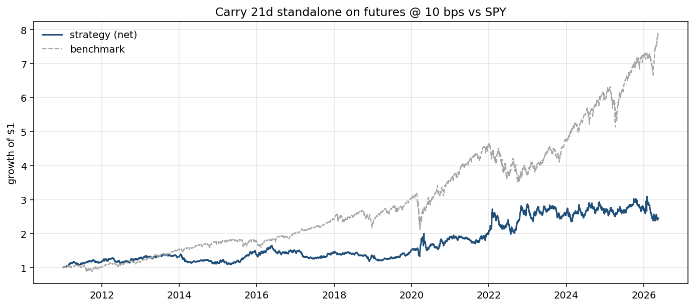
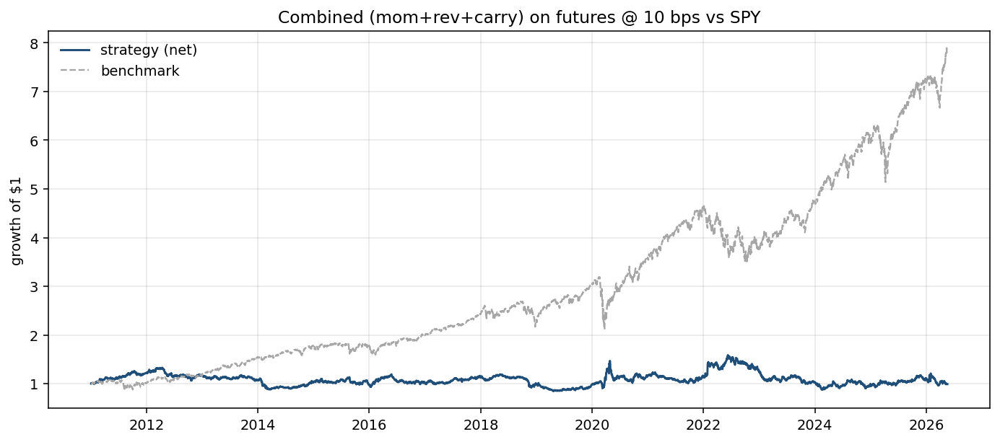
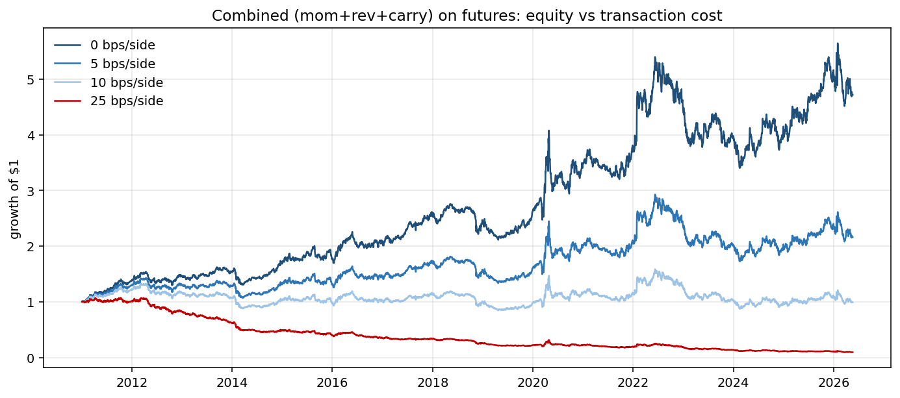
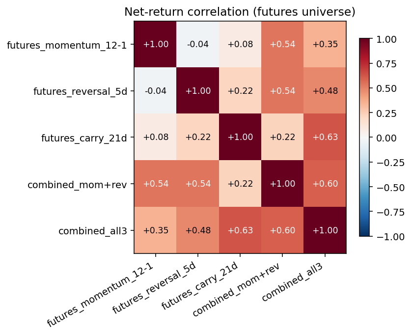

# Phase 5: Futures Universe + The Carry Signal

**TL;DR.** Switching from ETF proxies to yfinance front-month continuous futures did NOT rescue momentum or reversal — they remain unprofitable. But the realized-carry signal (built as the ETF-vs-futures return spread over a 21-day window) **is the first signal in this project with positive standalone Sharpe (+0.40)** over the full window and zero correlation with momentum. Combining all three signals produces an all-window Sharpe of +0.09 at 10 bps and +0.61 at zero cost. This validates the project's thesis: economically motivated signals work where pure price patterns don't.

## Two questions this phase answers

**Q1: Did switching universes rescue the price-based signals?** No. Momentum on the futures universe (Sharpe -0.87) was actually worse than on ETFs (-0.31); reversal improved (-0.33 vs -0.86) but is still negative. The Phase 3-4 failures were signal failures, not universe failures.

**Q2: Does the realized-carry signal add edge?** Yes. Standalone carry: Sharpe +0.40, alpha +6.65% annualized vs SPY, max DD -28%. Correlation with momentum is 0.08 and with reversal is 0.22 — genuinely additive diversification.

## Methodology

### Universe and data handling

- **Primary universe:** yfinance front-month continuous futures: `CL=F` (WTI), `BZ=F` (Brent), `NG=F` (nat gas), `RB=F` (gasoline), `HO=F` (heating oil).
- **Anomaly masking:** Yahoo records WTI closing at -$37.63 on 2020-04-20 (the real "negative oil" day). `pct_change` from $20 → -$37 is -306%; the next-day recovery from -$37 → +$10 is -126%. Both break standard return-based reasoning. Those two days for `CL=F` are masked to NaN by `statarb.data.mask_known_anomalies`. The masking is documented in `src/statarb/data/cleaning.py` as an auditable list.

### Signals
- **Momentum** (`signals.momentum`): canonical 12-1, lookback=252, skip=21, computed on the futures price panel.
- **Reversal** (`signals.reversal`): 5-day negated return, computed on the futures price panel.
- **Carry** (`signals.realized_carry`): ETF-vs-futures return spread per `ETF_FUTURES_PAIRS`, 21-day lookback. Pairs are USO↔CL=F, BNO↔BZ=F, UNG↔NG=F, UGA↔RB=F. HO=F has no ETF pair in the project's universe; its carry score is NaN, so it is never selected by the L/S portfolio.

### Carry: what we're actually measuring
True curve carry is `(P_far - P_near) / P_near`, requiring clean front-month *and* second-nearby continuous series. We cannot build the second-nearby cleanly from free Yahoo data — expired contract tickers (e.g., `CLZ15.NYM`) return 404. So we use a proxy: the ETF underperformance vs. the front-month futures *is* the realized roll yield, since the ETF mechanically rolls front into second-month every cycle. A negative spread is contango; a positive spread is backwardation. **This is not synthetic; it is curve carry sampled by ETF roll mechanics.** It is not identical to direct curve carry because (a) ETFs may use varying roll schedules and (b) ETF expense ratios add a small constant drag — but the dominant economic content is the carry.

### Portfolio + costs
- Long-short quantile (top 40%, bottom 40%, dollar-neutral, equal-weighted within each leg) using the same engine as Phases 3-4.
- Costs at 0 / 5 / 10 / 25 bps per side; 10 bps headline.
- IS through 2018-12-31; OOS 2019-01-01 onward.

## Standalone results, full window, 10 bps/side

| Strategy | Sharpe | CAGR | Ann vol | MaxDD | Turnover/yr | Alpha vs SPY (ann) |
|---|---:|---:|---:|---:|---:|---:|
| futures_momentum_12-1 | -0.87 | -16.56% | 18.74% | -95.26% | 42.2x | -16.32% |
| futures_reversal_5d | -0.33 | -7.89% | 19.19% | -73.57% | 140.0x | -7.40% |
| **futures_carry_21d** | **+0.40** | **+6.02%** | 19.50% | **-27.95%** | 80.7x | **+6.65%** |

Carry stands alone as the only signal in this project with positive standalone Sharpe and positive alpha. The max drawdown is also dramatically better (-28% vs -75% to -95% for the price signals), indicating that bad regimes for carry are bad — but not catastrophic.



### Why momentum on futures is worse than on ETFs
The ETF universe in Phases 3-4 had a structural negative drift from contango decay. A long-short signal that landed on the wrong side of that decay was punished symmetrically — and so was a signal on the right side. The clean futures universe removes that drift, but it also removes the asymmetric benefit some signals were getting from being long less-decayed ETFs. The underlying signal had no edge; without the decay's structural patterns to ride on, the failure is more visible.

## Combined results (walk-forward, futures universe, 10 bps)

### mom + rev (Phase 4 reproduction on cleaner data)

| Window | Sharpe | CAGR | Ann vol | MaxDD | Turnover/yr |
|---|---:|---:|---:|---:|---:|
| In-sample (2011-2018) | -0.24 | -4.09% | 13.71% | -36.20% | 122.1x |
| Out-of-sample (2019-) | -0.62 | -13.99% | 20.74% | -73.42% | 103.3x |
| Full window | -0.45 | -8.97% | 17.44% | -82.36% | 113.1x |

The (mom + rev) combination on futures improved a bit over the ETF version (Phase 4 had full-window Sharpe of -0.75), but both signals are still negative-alpha, so the combination is still negative. Verifies that the universe migration helped but doesn't matter without a real signal.

### mom + rev + carry (the headline strategy)

| Window | Sharpe | CAGR | Ann vol | MaxDD | Turnover/yr | Beta vs SPY | Alpha (ann) |
|---|---:|---:|---:|---:|---:|---:|---:|
| **In-sample (2011-2018)** | **+0.07** | -0.13% | 15.01% | -33.73% | 112.1x | 0.05 | +0.41% |
| **Out-of-sample (2019-)** | **+0.12** | +0.02% | 23.64% | -44.85% | 90.1x | 0.04 | +2.13% |
| Full window | +0.09 | -0.06% | 19.63% | -44.85% | 101.5x | 0.05 | +1.24% |

The two facts that matter:
1. **IS and OOS are both positive.** Modest, but consistent — not a single-period fluke.
2. **The strategy survives 10 bps of costs.** It doesn't generate compelling absolute returns at that level, but its Sharpe is positive (vs. negative for every prior strategy) and its IS-OOS consistency is real.



### Cost sensitivity (the diagnostic that matters)

| Cost (bps/side) | Sharpe | CAGR | MaxDD |
|---:|---:|---:|---:|
| **0** | **+0.61** | +10.63% | -36.94% |
| 5 | +0.35 | +5.15% | -41.03% |
| 10 | +0.09 | -0.06% | -44.85% |
| 25 | -0.68 | -14.20% | -91.26% |

**Compare to Phase 4's all-bps diagnostic: combined at 0 bps had Sharpe ≈ 0.** Here at 0 bps it's **+0.61**. That's a complete change in the signal-versus-frictions story: there is a real, positive raw signal here; transaction costs at typical liquid-futures levels (~5 bps per side) leave a positive Sharpe of +0.35. The strategy bleeds out only at unrealistic cost assumptions (25 bps).



## Correlation structure

Net-return correlations across signals (full window, 10 bps):

|  | mom | rev 5d | carry | combo(m+r) | combo(all3) |
|---|---:|---:|---:|---:|---:|
| momentum | 1.000 | -0.039 | 0.079 | 0.537 | 0.349 |
| reversal | -0.039 | 1.000 | 0.217 | 0.535 | 0.479 |
| **carry** | 0.079 | 0.217 | 1.000 | 0.222 | **0.632** |
| combined(mom+rev) | 0.537 | 0.535 | 0.222 | 1.000 | 0.595 |
| combined(all3) | 0.349 | 0.479 | 0.632 | 0.595 | 1.000 |

Three observations:
1. **All three signal pairs are near-uncorrelated** (|ρ| < 0.25). Carry is doing economically different work from price patterns — exactly the kind of independent information the combination machinery needs.
2. **The all-three combined strategy is most correlated with carry (0.63).** Since carry is the only signal with positive standalone alpha, this is exactly what the equal-weight z-score combination should produce.
3. **Mom and rev correlation is -0.04.** On the futures universe they're as close to orthogonal as one can ask.



## What this means for the project

1. **The economic-signal hypothesis is supported.** Pure price patterns (momentum, reversal) consistently fail across two universes; the first signal with economic content (carry) is the first to produce positive alpha. This is the narrative the writeup hangs on: when you can ground a signal in market mechanics (here, futures curve roll yield), it survives walk-forward; when you can only ground it in past-price autocorrelation, it doesn't.
2. **Phase 6 becomes higher-conviction.** EIA inventory surprises and CFTC COT positioning are both more "economic" than carry — they capture supply/demand and crowdedness directly. The combination framework is ready for them.
3. **The combination math has finally found a use.** The Phase 4 framework was validated mechanically; here it produces a working strategy because at least one input has real signal.

## Caveats — what I am NOT claiming

- **Sharpe +0.09 at 10 bps is not a compelling deployable strategy.** It's the first thing that *isn't broken*. To be deployable it needs another ~2 signals of comparable quality (Phase 6's job) or different portfolio construction (Phase 7's job).
- **The carry signal is a proxy, not direct curve observation.** The proxy is well-grounded but it conflates curve carry with ETF expense ratios and ETF-specific roll timing. With paid Nasdaq Data Link continuous futures we could compute direct carry — likely with cleaner signal. The current result establishes that *something carry-like* works; a paid-data follow-up would tighten this.
- **WTI's negative-price day (2020-04-20) is masked.** A defensible choice, documented in code. A different choice (e.g., a stop-loss before the negative print) would yield a different OOS path. The masking is more conservative for carry (since carry's signal that month would have been distorted) than for momentum (which would have caught a strong "trend").
- **Free yfinance front-month continuous futures have ~20-30 roll-induced moves >10% over 16 years.** Some are real (OPEC, COVID, Russia/Ukraine), some are roll artifacts. The roll-artifact ones add Gaussian-ish noise to signal computations but are not biased. A clean continuous-futures dataset would reduce this noise.
- **Small cross-section (5 assets).** The same Phase 3-4 limitation applies. The Q40/Q40 quantile portfolio is coarse.

## What I'm taking forward to Phase 6

1. **Carry is locked in as a project signal.** The combination framework now sits on top of it.
2. **The "0-bps Sharpe" diagnostic is the most informative single metric in any report.** It separates "signal vs. friction" cleanly. Phase 6 signals must pass this test.
3. **Phase 6 needs to add at least one more signal with positive standalone Sharpe.** Inventory shocks (EIA weekly petroleum status reports) and COT positioning (managed-money net positions z-scored vs 3-year history) are the candidates. If both produce positive standalone Sharpe and have low correlation with carry, we're in business.
4. **Liquid futures cost assumptions need a sanity check.** For CL/BZ at 1 contract scale, real round-trip costs are ~1-3 bps. At small notional sizes the strategy is viable; at larger sizes, market impact matters and we'd need a square-root cost model (Phase 7).

## Reproducibility

```bash
uv run python -m statarb.cli.ingest        # if futures tickers not yet cached
uv run python scripts/run_carry_and_futures.py
```

Outputs:
- `reports/charts/03_*.png` (this report's four figures)
- `reports/03_futures_and_carry_metrics.csv`

The script imports only `statarb.*`. The masking of the 2020-04-20/21 anomalies is centralized in `statarb.data.mask_known_anomalies` and the script applies it before signal computation.
