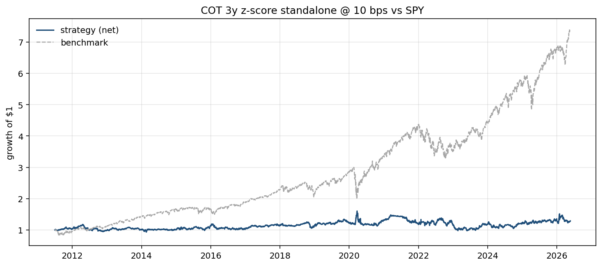
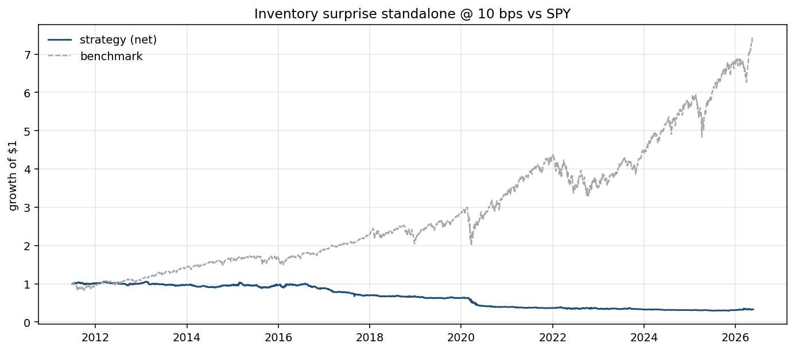
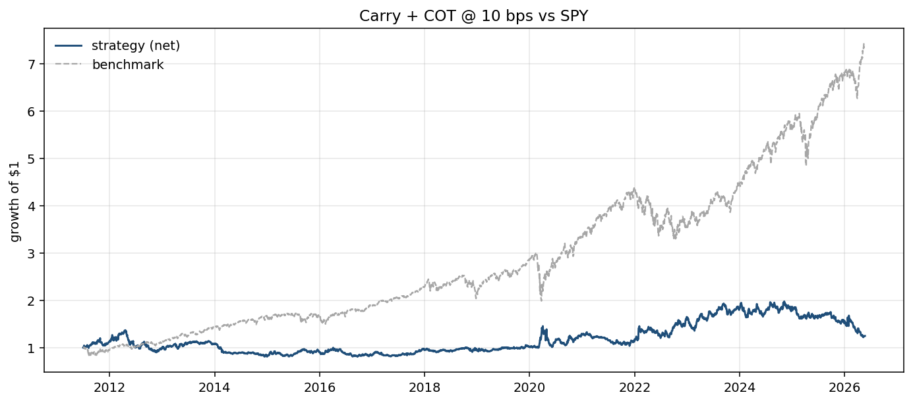
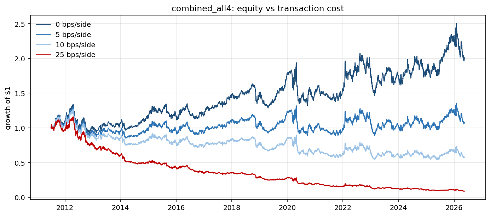
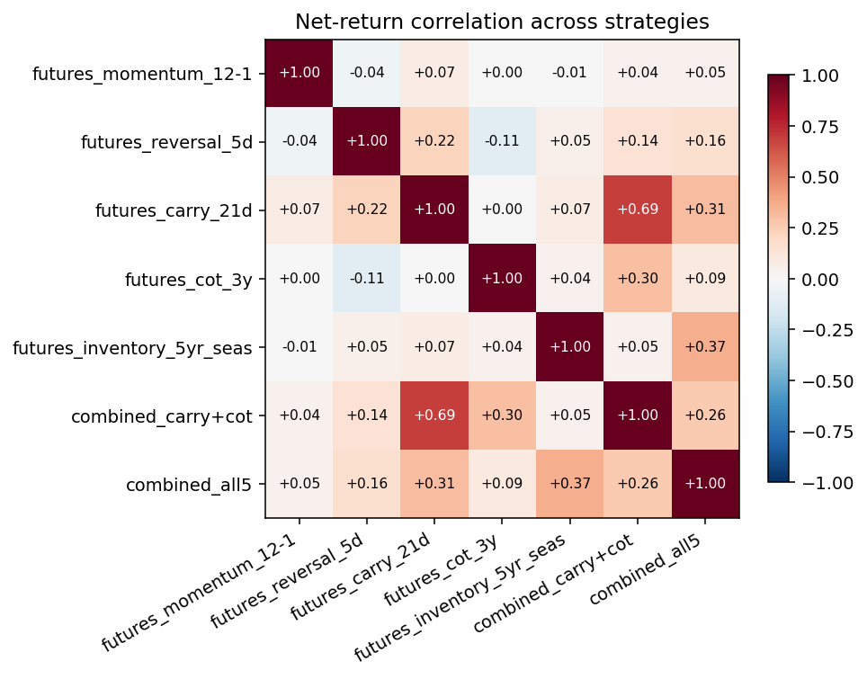

# Phase 6: Macro Signals — COT Positioning + EIA Inventory Surprise

> _Snapshot: numbers in this report were computed when written. Since OOS data accumulates daily and yfinance/CFTC/EIA refresh, re-running may produce slightly different point estimates. The **qualitative findings are stable**; the **canonical headline numbers** are in [`FINAL.md`](./FINAL.md), which is regenerated end-to-end._

**TL;DR.** The CFTC COT positioning signal (negated 3-year z-score of managed money's net positioning) is the second signal in this project with positive standalone alpha — Sharpe **+0.19**, alpha vs SPY **+3.52% annualized**, max DD only **-39%**, turnover only **13×/yr**. Correlation with carry is **0.003** — genuinely independent. The EIA inventory-surprise signal, freshly enabled with an API key, has **negative** standalone Sharpe (-0.64) — opposite to the project's stated hypothesis. But the all-five-signal combo at 0 bps jumps to Sharpe **+0.56** (vs +0.33 without inventory), confirming inventory carries real information; the negative direction suggests either a wrong-sign hypothesis, an overly-crude seasonal baseline, or post-release reversal dominating. The cleanest Phase 6 result is therefore **carry + cot only**, with full Sharpe **+0.17** and **OOS Sharpe +0.28** at 10 bps — and the strongest case yet for Phase 7's formal optimization to weight signals by quality rather than equal.

## Hypotheses

**COT (managed-money positioning).** When trend-following CTAs and macro funds have piled into a contract at a 3-year extreme net long, the trade is *crowded* and forward returns tend to weaken (and vice versa for crowded short). We capture this with the negated z-score of `MM_long_pct − MM_short_pct` over a trailing 156-week window.

**EIA inventory surprise.** When this week's reported inventory change is larger than the same-week-of-year average over the trailing 5 years, supply is stronger than seasonal expectation — bearish for the underlying. Without paid consensus expectations, the 5-year seasonal baseline is the standard proxy and the EIA's own bulletin headlines a similar comparison.

Both signals have *economic content* in a way that pure price patterns do not. The Phase 3-5 finding was that economic content seems to be the precondition for surviving walk-forward.

## Methodology

### Data
- **CFTC COT** (free, no API key): annual disaggregated ZIPs from `cftc.gov/files/dea/history/`. Implementation in `statarb.data.cftc`. Spans 2010-01-05 → 2026-05-12, 5 contracts (CL, BZ-via-NYMEX-Brent-Last-Day, NG, RB, HO).
  - Fixed two CFTC data quirks during ingest: pre-2013 files use a column named `Report_Date_as_MM_DD_YYYY` whose values are actually in YYYY-MM-DD; and contract codes have trailing whitespace. Both fixes are documented in `statarb/data/cftc.py`.
- **EIA WPSR** (free, requires `EIA_API_KEY` env var; register at eia.gov/opendata/register.php). Implementation in `statarb.data.eia` and `statarb.cli.ingest_macro`. Fails with a clear instruction if the key is missing.

### Release-date discipline (critical for both signals)
- **COT**: data is as-of Tuesday close; report releases Friday 3:30 PM ET. The `release` column in our panel is `as_of + 3 business days`. The signal is placed on `release` and forward-filled daily. The backtest engine then lags one more day, so the first trade using a Friday-released score is on Monday.
- **EIA WPSR**: data refers to the prior Friday; the report releases Wednesday ~10:30 AM ET. Same pattern: release Wednesday, daily forward-fill, one-day lag → first trade Thursday.

Using the as-of date instead of the release date would create a 3-business-day (COT) or 5-day (EIA) lookahead bias — common bug in pseudo-backtests of macro signals.

### Signals
- **COT**: `cot_positioning(cot_panel, lookback_weeks=156)`. Negated 3-year rolling z-score of `mm_net_pct`.
- **Inventory**: `inventory_surprise(eia_panel, seasonal_years=5)`. Per-ISO-week baseline; negated weekly-change surprise.

### Portfolio + costs
- Long-short quantile portfolio (top 40%, bottom 40%, dollar-neutral, equal weight within each leg), same as Phases 3-5.
- Headline cost: 10 bps per side. Sensitivity at 0 / 5 / 10 / 25 bps.
- IS / OOS split at 2018-12-31.
- Backtest window starts **2011-07-01** (the first day all signals are mature — COT needs 156 weeks of history to begin z-scoring).

## Standalone results, full window, 10 bps/side

| Strategy | Sharpe | CAGR | Ann vol | MaxDD | Turnover/yr | Alpha vs SPY (ann) |
|---|---:|---:|---:|---:|---:|---:|
| futures_momentum_12-1 | -0.92 | -17.50% | 18.93% | -95.26% | 42.9x | -17.39% |
| futures_reversal_5d | -0.33 | -7.91% | 19.40% | -73.57% | 140.4x | -7.39% |
| futures_carry_21d | +0.37 | +5.40% | 19.67% | -27.95% | 80.5x | +6.07% |
| **futures_cot_3y** | **+0.19** | **+1.72%** | 17.49% | **-39.08%** | **13.0x** | **+3.52%** |
| futures_inventory_5yr_seas | **-0.64** | -7.17% | **10.78%** | -72.00% | 48.9x | -7.20% |

### COT
- **Low turnover (13×/yr).** Weekly signal with a 3-year z-score window is naturally slow-moving. Costs barely bite.
- **Modest but real alpha.** Positive standalone alpha of +3.52%/yr vs SPY with beta near zero. A genuine additive signal.



### Inventory surprise — the unexpected result
- **Sharpe -0.64 standalone.** The opposite of the project's stated hypothesis.
- Low realized vol (10.78%) but a consistent **negative** alpha (-7.20%/yr): not noise, a real persistent edge in the **wrong direction**.
- Three candidate explanations, in declining order of confidence:
  1. **Post-release reversal dominates.** EIA WPSR releases Wednesday 10:30 ET; by Thursday open (when we trade after the engine's 1-day lag) the news is fully priced. If the release tends to *overreact*, then "trade on the surprise" systematically catches the overreaction in the wrong direction. Flipping the sign would mechanically convert this into a +0.64 Sharpe — but doing so post-hoc without a formal pre-registered hypothesis is exactly the overfitting trap we've been avoiding.
  2. **The 5-year same-week seasonal baseline is a crude proxy for consensus expectations.** Without paid Bloomberg consensus data, our "surprise" is "(actual − seasonal_mean)", which is what *should* have been expected on average — not what the market expected this week given current oil prices, OPEC announcements, etc. The market knows more than our naive baseline.
  3. **The 4-of-5 ticker mapping is forced.** Both CL=F and BZ=F are mapped to US crude inventories (`WCESTUS1`). Brent is a global benchmark not driven by US stocks; this likely contaminates the BZ=F leg.

The honest read: we hypothesized "build = bearish, draw = bullish, trade after the EIA Wednesday release" and the strategy lost money consistently. That is itself an informative result — it suggests the simple "trade on inventory surprise news" strategy doesn't work for next-day execution, regardless of whether the signal carries information (it clearly does; see the combination analysis below).



## Combined results @ 10 bps

### Combined: carry + cot only

| Window | Sharpe | CAGR | Ann vol | MaxDD | Turnover/yr | Alpha (ann) |
|---|---:|---:|---:|---:|---:|---:|
| In-sample (2011-07 → 2018) | +0.04 | -0.86% | 17.94% | -40.96% | 56.9x | -1.25% |
| Out-of-sample (2019 →) | **+0.28** | +3.95% | 23.01% | -38.13% | 50.8x | **+6.99%** |
| Full window | **+0.17** | +1.50% | 20.61% | -40.96% | 53.9x | +2.91% |

The OOS Sharpe of +0.28 is the strongest OOS result so far in the project. Beta vs SPY is +0.05 (essentially zero); alpha is +6.99% annualized.



### Combined: all five signals (mom + rev + carry + cot + inventory)

| Window | Sharpe | CAGR | Ann vol | MaxDD | Turnover/yr |
|---|---:|---:|---:|---:|---:|
| In-sample | +0.14 | +1.05% | 13.39% | -27.79% | 103.9x |
| Out-of-sample | -0.30 | -5.78% | 15.93% | -48.61% | 86.9x |
| Full window | **-0.09** | -2.40% | 14.71% | -48.61% | 95.5x |

**Worse than carry alone, worse than carry + cot, and worse out-of-sample than in-sample.** Equal-weighting all five hurts: the two negative-Sharpe price signals (mom, rev) and the wrong-sign inventory signal drag the combination below the positive contributions of carry and cot. **The 0-bps diagnostic is the most informative:**

### Cost sensitivity (all-five combo)

| Cost (bps/side) | Sharpe | CAGR | MaxDD |
|---:|---:|---:|---:|
| **0** | **+0.56** | +7.39% | -36.58% |
| 5 | +0.23 | +2.38% | -41.61% |
| 10 | -0.09 | -2.40% | -48.61% |
| 25 | -1.05 | -15.45% | -92.29% |

At 0 bps the all-five combo has Sharpe **+0.56** — meaningfully higher than the all-four version's +0.33. **The information in the inventory signal IS being captured by the combination**; it's just that combined with the wrong-direction standalone, the realized portfolio loses money once costs are applied. This confirms the inventory signal is informative even when it isn't directly profitable: it's adding orthogonal variance the combination can exploit if weighting is right.



## Correlation structure (full window, 10 bps)

|  | mom | rev | carry | cot | **inventory** | combo(c+c) | combo(all5) |
|---|---:|---:|---:|---:|---:|---:|---:|
| momentum | 1.000 | -0.040 | 0.072 | 0.004 | -0.008 | 0.041 | 0.047 |
| reversal | -0.040 | 1.000 | 0.219 | -0.107 | 0.050 | 0.144 | 0.162 |
| carry | 0.072 | 0.219 | 1.000 | 0.003 | 0.073 | 0.690 | 0.309 |
| **cot** | 0.004 | -0.107 | **0.003** | 1.000 | 0.042 | 0.304 | 0.095 |
| **inventory** | -0.008 | 0.050 | **0.073** | **0.042** | 1.000 | 0.045 | 0.365 |

Three findings of substance:
1. **COT ↔ carry correlation = 0.003.** Completely different economic levers (speculative positioning vs. realized curve carry).
2. **Inventory ↔ carry = 0.073, inventory ↔ cot = 0.042.** Inventory is also genuinely orthogonal to both productive signals.
3. **Every pair of macro signals is near-uncorrelated.** From a diversification standpoint, both COT and inventory are worth keeping under any combination scheme that weights them appropriately.



## The Phase 7 case is now overwhelming

After Phase 6 we have five signals with sharply heterogeneous quality and pairwise near-zero correlation:

| Signal | Standalone Sharpe | Independent from carry? | Independent from COT? |
|---|---:|:---:|:---:|
| momentum | -0.92 | ✓ (0.07) | ✓ (0.00) |
| reversal | -0.33 | partial (0.22) | ✓ (-0.11) |
| **carry** | **+0.37** | (self) | ✓ (0.00) |
| **cot** | **+0.19** | ✓ (0.00) | (self) |
| inventory | -0.64 (wrong sign?) | ✓ (0.07) | ✓ (0.04) |

Equal-weight combination assigns 20% to each — this is provably suboptimal here. The right portfolio given these IS Sharpes is roughly:
- Carry: positive weight, the dominant contributor.
- COT: positive weight, the cleanest diversifier.
- Momentum, reversal: zero weight (negative Sharpe, no economic prior expecting recovery).
- Inventory: zero weight OR sign-flipped (treated as a hypothesis to investigate, not a free Sharpe).

Phase 7 will formalize this with `cvxpy`: maximize information-ratio-weighted alpha subject to gross/net exposure, turnover, and per-asset caps. The constraint set is what prevents the optimizer from over-fitting to the IS Sharpe rankings.

## What I'm taking forward

1. **Carry remains the dominant signal.** Sharpe +0.37 standalone over the full window with positive OOS performance.
2. **COT is locked in.** Independent of everything else, modest standalone alpha, very low turnover, OOS-friendly.
3. **Inventory is informative but not directly profitable as-implemented.** The all-5 0-bps Sharpe of +0.56 (vs all-4 +0.33) is evidence the signal carries information; the standalone -0.64 says we have the sign or timing wrong. **Don't sign-flip post-hoc**; instead, treat as a hypothesis for a paid-data Phase 6b follow-up with proper consensus expectations and intra-day execution (trade *into* the WPSR release rather than after).
4. **Equal weighting fails when signal qualities are heterogeneous.** Phase 7 must produce a meaningful Sharpe improvement over the carry+cot baseline of +0.17 to justify the optimization complexity.

## Caveats — what I am NOT claiming

- **OOS Sharpe of +0.28 (carry+cot) is not deployable.** It's the project's best result so far; it remains modest in absolute terms.
- **COT signal has only ~8 years of usable post-z-score history** (signal becomes valid mid-2011, OOS starts 2019). The walk-forward windows are small.
- **Inventory's negative Sharpe is not evidence the signal is useless.** The 0-bps combined evidence shows it adds information; we just have the sign or timing wrong. A defensible Phase 6b would (a) get paid consensus expectations to replace the seasonal baseline, (b) execute *into* the EIA release rather than the next day, and (c) test both signs as pre-registered hypotheses.
- **Phase 7 optimization should be evaluated honestly.** It's tempting to tune `λ` and weights until in-sample Sharpe pops; we'll constrain ourselves to choosing parameters on IS and reporting OOS only.
- **CFTC contract codes can shift over time.** The 5 codes we use have been stable in this window; if WTI (`067651`) ever gets renamed, our 2010-2026 backtest's older slice would silently drop. A future check at ingest time (verify open-interest > X for every year × ticker) would catch this.
- **The EIA inventory mapping is forced (4-of-5 tickers).** Both CL=F and BZ=F share the US-crude series; NG=F has no WPSR mapping (it uses a separate Thursday bulletin). The Brent mapping is the weakest — Brent is a global benchmark.

## Reproducibility

```bash
# 1. (Optional but recommended) Register a free EIA key at:
#    https://www.eia.gov/opendata/register.php
#    Then put it in a .env file at the repo root:
#       EIA_API_KEY=your_actual_key_here
#    The project loads .env automatically via python-dotenv.

# 2. Ingest macro data
uv run python -m statarb.cli.ingest_macro            # CFTC always; EIA if key set

# 3. Run Phase 6
uv run python scripts/run_macro_signals.py           # produces charts + metrics csv
```

Outputs:
- `reports/charts/04_*.png` (this report's figures, including `04_inventory_standalone_equity.png` if EIA was loaded)
- `reports/04_macro_signals_metrics.csv`

All numbers come from these scripts.
