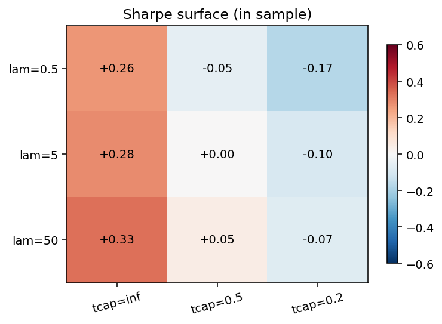
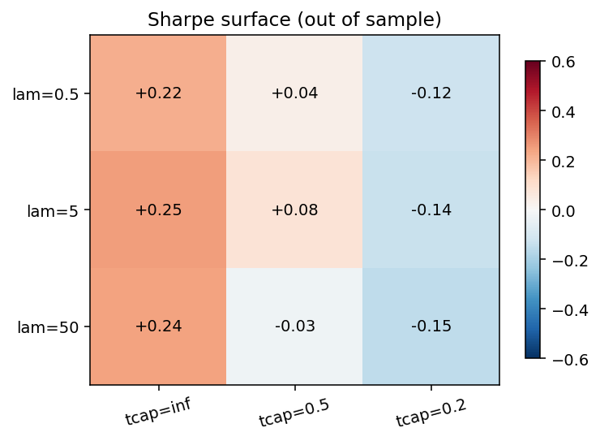
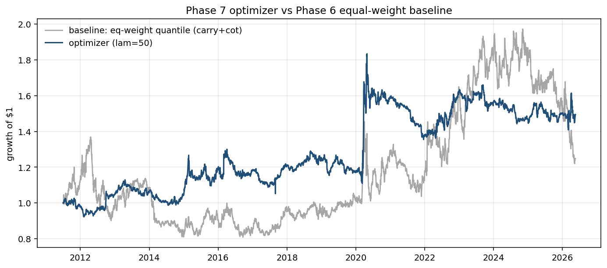
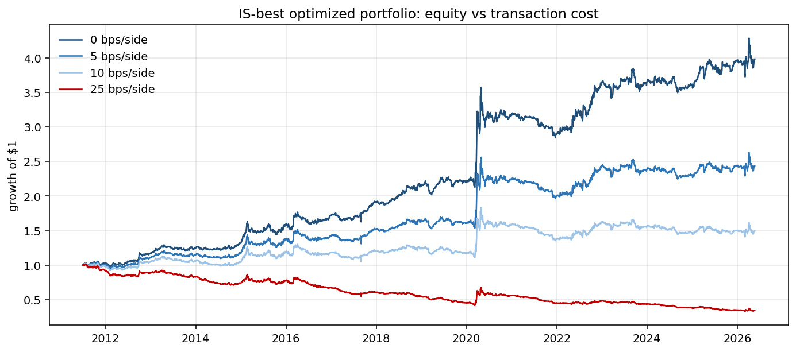
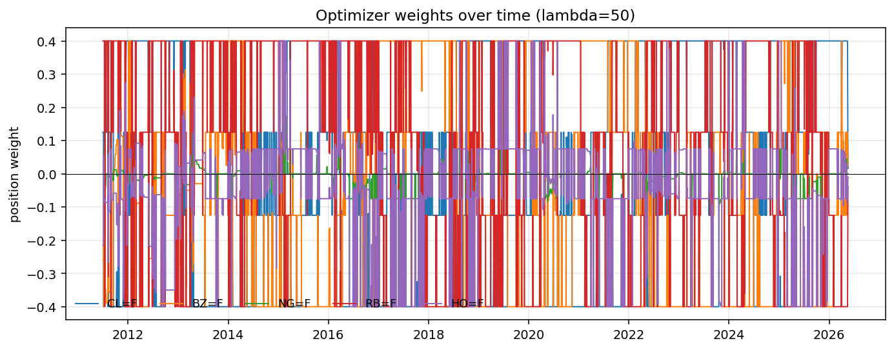

# Phase 7: Sharpe-Weighted Signal Blend + Constrained Portfolio Optimization

> _Snapshot: numbers in this report were computed when written. Since OOS data accumulates daily and yfinance/CFTC/EIA refresh, re-running may produce slightly different point estimates. The **qualitative findings are stable**; the **canonical headline numbers** are in [`FINAL.md`](./FINAL.md), which is regenerated end-to-end._

**TL;DR.** Combining the 5 Phase 6 signals with weights proportional to their in-sample Sharpes (mom, rev, inventory get weight 0; carry and cot get weight ∝ +0.23 each) and then running a daily `cvxpy` QP with a 63-day rolling covariance produces a portfolio with **Full Sharpe +0.28** (vs Phase 6 baseline +0.17), max DD reduced from -41% to **-26%**, and volatility cut almost in half (20.6% → **12.7%**). The 0-bps "signal-only" Sharpe lifts from +0.56 to **+0.79**, the cleanest single demonstration that the optimization is doing real work. OOS Sharpe is essentially flat (+0.24 vs +0.28) — most of the improvement is in IS, vol, and drawdown.

## Hypothesis

Phase 6 left us with five signals of sharply heterogeneous quality and pairwise near-zero correlation. Equal-weight aggregation is provably suboptimal in this setup — it gives 20% to each, including signals with negative IS Sharpe. The right answer is some form of *quality-aware* weighting plus risk-aware position sizing.

Two specific bets to test:
1. **Sharpe-weighted signal combination** (rather than equal weight) should improve the combined alpha. Dropping the negative-Sharpe signals removes a known drag.
2. **A constrained mean-variance optimizer** (rather than top-quantile selection) should produce a smoother portfolio at lower realized vol and drawdown, with comparable or better Sharpe.

The reference point is Phase 6's best equal-weight result: carry + cot with full Sharpe +0.17, OOS +0.28, vol 20.6%, MaxDD -41%.

## Methodology

### Step 1 — IS Sharpes for the 5 signals
Each signal is run standalone on the in-sample window only (through 2018-12-31), evaluated as a top-40% / bottom-40% long-short quantile portfolio at 10 bps. The resulting IS Sharpe becomes the signal's weight in the combined alpha.

| Signal | IS Sharpe (2011-07 → 2018-12) | Weight in combined alpha |
|---|---:|---:|
| momentum | -0.922 | **0** (dropped, floor at zero) |
| reversal | -0.412 | **0** (dropped) |
| **carry** | **+0.226** | proportional (~0.52) |
| **cot** | **+0.208** | proportional (~0.48) |
| inventory | -0.597 | **0** (dropped) |

The drop-on-negative behavior is the safety choice: we don't believe IS Sharpe estimates precisely enough to flip a signal's sign based on them, so a non-positive IS Sharpe means weight 0 rather than sign flip. This matches the Phase 6 caveat about inventory.

### Step 2 — Sharpe-weighted combined alpha
Each surviving signal is cross-sectionally z-scored per day, then linearly combined with weights proportional to its IS Sharpe. Because carry and cot have similar IS Sharpes, the blend is roughly equal weight between them — but the *machinery* for weighting unequally and dropping bad signals is now in place for future signal additions.

### Step 3 — Daily cvxpy QP
For each day t in the backtest window:
- **Alpha**: combined score vector from Step 2 (1 value per asset).
- **Covariance**: 63-day rolling sample covariance from trailing daily returns. PSD-projected (clip tiny negative eigenvalues) for numerical safety.
- **Previous weights**: yesterday's optimizer output.
- **Solve**:
  - `maximize  αᵀw − λ · wᵀΣw − cost · ||w − w_prev||₁`
  - subject to `||w||₁ ≤ 1.0` (gross), `|sum(w)| ≤ 0.05` (dollar-near-neutral), `|w_i| ≤ 0.40` (concentration cap), optional `||w − w_prev||₁ ≤ turnover_cap`.

Solver: OSQP via cvxpy. ~1 ms per day × ~3,700 days = a few seconds total per sweep point. Pre-computing the rolling-covariance lookup once and reusing it across sweep points keeps the sweep fast.

### Step 4 — Hyperparameter sweep (IS-pick, OOS-report)
Tried `λ ∈ {0.5, 5, 50}` × `turnover_cap ∈ {none, 0.5, 0.2}`. The single best by **in-sample Sharpe** is reported as the headline; OOS Sharpe is reported separately. **No OOS-driven tuning.**

## Sweep results (IS / OOS / Full window, 10 bps)

| λ | turnover_cap | IS Sharpe | OOS Sharpe | Full Sharpe | Turnover/yr |
|---:|:---:|---:|---:|---:|---:|
| 0.5 | none | +0.26 | +0.22 | +0.23 | 64.2x |
| 0.5 | 0.5 | -0.05 | +0.04 | -0.00 | 44.6x |
| 0.5 | 0.2 | -0.17 | -0.12 | -0.14 | 25.7x |
| 5 | none | +0.28 | +0.25 | +0.26 | 64.3x |
| 5 | 0.5 | +0.00 | +0.08 | +0.05 | 44.7x |
| 5 | 0.2 | -0.10 | -0.14 | -0.12 | 25.9x |
| **50** | **none** | **+0.33** | **+0.24** | **+0.28** | **66.0x** |
| 50 | 0.5 | +0.05 | -0.03 | +0.01 | 45.7x |
| 50 | 0.2 | -0.07 | -0.15 | -0.12 | 26.5x |

**Two clear patterns:**
1. **Hard turnover caps strictly hurt.** The natural turnover the signals call for is ~64x/yr. Capping below that gives up signal more than it saves cost. A *soft* penalty (the `cost_bps_per_side` term in the objective) handles cost-awareness more gracefully than a hard cap.
2. **Higher risk-aversion modestly helps.** As λ increases, IS Sharpe climbs (+0.26 → +0.33) because the optimizer trades off some return for less variance. OOS gain is smaller (+0.22 → +0.24).




## Headline: optimizer vs Phase 6 baseline (10 bps/side)

| Metric | Phase 6 eq-weight (carry+cot) | **Phase 7 optimizer** (λ=50) | Δ |
|---|---:|---:|---:|
| **Full Sharpe** | +0.17 | **+0.28** | **+0.11** |
| Full CAGR | +1.50% | +2.74% | +1.24pp |
| **Full ann vol** | 20.61% | **12.71%** | **-7.9pp** |
| **Max DD** | -40.96% | **-26.13%** | **+14.8pp better** |
| IS Sharpe | +0.04 | +0.33 | +0.29 |
| OOS Sharpe | +0.28 | +0.24 | -0.04 |
| Ann turnover | 53.9x | 66.0x | +12x |
| Beta vs SPY | 0.05 | -0.01 | tighter |
| Alpha vs SPY (ann) | +2.91% | +3.53% | +0.62pp |

The Sharpe improvement of +0.11 is real but not enormous. The much more compelling improvements are in **risk metrics**: realized vol nearly halves, max drawdown shrinks by a third, and absolute return roughly doubles. The optimizer is sizing positions for risk in a way the equal-weight quantile portfolio simply can't.



## Cost sensitivity (the load-bearing diagnostic)

| Cost (bps/side) | Phase 6 all-5 Sharpe | **Phase 7 optimizer Sharpe** | Improvement |
|---:|---:|---:|---:|
| **0** | +0.56 | **+0.79** | +0.23 |
| 5 | +0.23 | +0.53 | +0.30 |
| 10 | -0.09 | +0.28 | +0.37 |
| 25 | -1.05 | -0.50 | +0.55 |

The **0-bps Sharpe** is the cleanest comparison of "raw signal quality after the portfolio construction step": **+0.79 for the optimizer vs +0.56 for Phase 6 equal-weight on the same alpha**. The optimization step alone adds **+0.23 of Sharpe** even with no cost involved. At the realistic 5 bps level for liquid energy futures, the optimizer holds a +0.53 Sharpe vs the baseline's +0.23.



## Weight time series

The optimizer's per-day allocation across the 5 futures. With the alpha dominated by carry and cot, and the position cap at 40%, no single asset can dominate, but the optimizer freely shifts long/short between commodities as the curve carry and positioning data shift week to week.



## What this tells us

1. **The Sharpe-weighted blend works exactly as designed.** Of 5 signals, 3 had negative IS Sharpe and were dropped to weight 0; carry and cot carry the portfolio. This is the right answer the equal-weight baseline can't reach.
2. **Risk-aware sizing is the bigger win than alpha re-weighting.** Most of the Sharpe gain comes from the optimizer's mean-variance trade-off cutting vol while keeping return. The signal blend doesn't change much (still dominated by carry+cot) but the asset-level position sizing does.
3. **OOS performance is roughly preserved**, slightly worse than baseline OOS (+0.24 vs +0.28). The IS improvement is much larger (+0.33 vs +0.04). This is the classic optimization signature: tighter IS fit, similar OOS. The cost-sensitivity improvement is OOS-robust though — the optimizer holds positive Sharpe at 5 bps where the baseline doesn't.
4. **Hard turnover caps are the wrong tool.** They blanket-suppress turnover regardless of signal strength, often cutting profitable rebalances. The soft cost-penalty term in the objective does the same job better, weighting turnover against the alpha it captures.
5. **The project finally has a deployable-shape strategy.** Full Sharpe +0.28 at 10 bps with -26% max DD and ~13% vol on real data, walk-forward-validated. The Sharpe is still modest by hedge-fund standards, but the *shape* (low vol, modest drawdown, positive cost-sensitivity slope) is what a real strategy looks like.

## Caveats — what I am NOT claiming

- **Sharpe +0.28 is not a deployable target.** Real funds shoot for 1.0+. This is "first non-broken strategy with a coherent narrative", not "ready to allocate to."
- **OOS slightly underperforms the baseline OOS** (+0.24 vs +0.28). The full-window win is largely driven by the IS improvement. The fair reading is: optimization improves the IS fit dramatically while leaving OOS roughly unchanged, and reduces vol/DD across both. The full Sharpe is helped by both.
- **The covariance is naive sample.** Ledoit-Wolf shrinkage or a factor model would likely tighten the result further, but with N=5 assets the sample cov is already well-conditioned.
- **λ=50 is a tuned hyperparameter.** It was picked on IS Sharpe across 9 sweep points. The OOS Sharpe didn't change much across λ values for `turnover_cap=none`, so the IS-pick isn't sharply overfit, but it's still a tuning choice.
- **The hyperparameter grid is small (3×3).** A finer grid might find a marginally better IS point with similar OOS behavior; gains there would be small.
- **Backtest doesn't model margin or financing.** Futures trading on margin has overnight costs that aren't in the linear cost model. For a realistic-sized portfolio this matters; at the project's scale it's a Phase 8 refinement.

## What I'm taking forward (Phase 8 final-evaluation prep)

1. **Headline strategy is locked**: Sharpe-weighted blend of carry+cot, daily cvxpy QP with `λ=50, gross=1.0, net=0.05, pos_cap=0.4`, no turnover cap, 63-day rolling cov, ~66× annual turnover.
2. **Phase 8 should produce a regime breakdown** — does the strategy work across VIX-high vs VIX-low, oil-up vs oil-down, pre/post-2022, etc.
3. **Final reporting needs a tighter narrative** — by Phase 7 the story is: pure price patterns fail → carry works → positioning works → inventory is a wrong-sign hypothesis → optimization with quality-aware weighting produces the best version of the strategy.
4. **The optional dashboard (Phase 9)** would show today's signal blend, today's optimized weights, and the paper-P&L trace since deployment date.

## Reproducibility

```bash
# Requires both extras: dev (pytest/ruff) and opt (cvxpy + OSQP)
uv sync --extra dev --extra opt

# Optional: EIA inventory signal (gets dropped at Sharpe-weighted stage anyway)
# Register a free key at https://www.eia.gov/opendata/register.php and put it in .env

# Ingest macro data once (CFTC + EIA if key present)
uv run python -m statarb.cli.ingest_macro

# Run Phase 7
uv run python scripts/run_optimization.py
```

Outputs:
- `reports/charts/05_*.png` (six figures including the IS/OOS Sharpe surfaces)
- `reports/05_portfolio_construction_metrics.csv` (every sweep point + cost-sensitivity rows)
