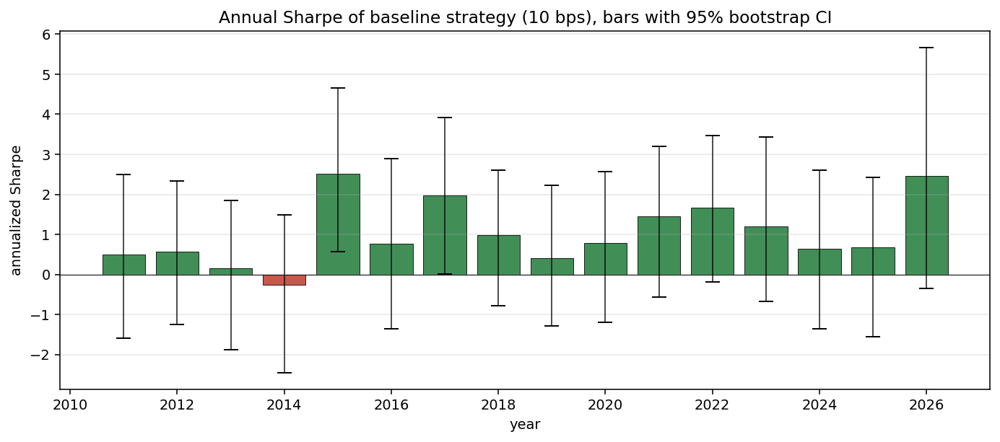
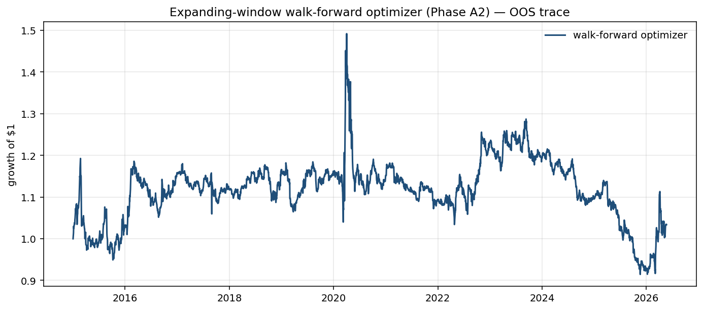

# Phase A2: Walk-Forward Analysis

> _Snapshot: numbers in this report were computed when written. Since OOS data accumulates daily and yfinance/CFTC/EIA refresh, re-running may produce slightly different point estimates. The **qualitative findings are stable**; the **canonical headline numbers** are in [`FINAL.md`](./FINAL.md), which is regenerated end-to-end._

**TL;DR.** Two complementary analyses on the locked headline strategy:

1. **Year-by-year baseline:** the equal-weight carry+cot baseline produced **positive Sharpe in 15 of 16 calendar years** (94%) over 2011-2026. Median annual Sharpe **+0.78**, range [-0.27, +2.52]. Worst single-year loss: -2.4% (2014). The consistency-per-year story is the single strongest defense of "this works year after year, not in a few good ones."

2. **Walk-forward optimizer:** re-fitting signal Sharpe-weights expanding-window-style each year did NOT rescue the Phase 7 optimizer. Concatenated OOS Sharpe across 12 OOS years is **+0.09 (95% CI [-0.49, +0.58])**. The optimizer's failure is structural (covariance estimation noise + Markowitz fragility), not a problem with static signal weighting.

## Part 1 — Year-by-year baseline (equal-weight carry+cot)

| Year | Days | Sharpe | 95% CI | Ann return | Ann vol | Sig? |
|---:|---:|---:|:---:|---:|---:|:---:|
| 2011 | 127 | +0.50 | [-1.59, +2.50] | +5.7% | 11.5% | No |
| 2012 | 250 | +0.56 | [-1.25, +2.34] | +5.5% | 9.9% | No |
| 2013 | 252 | +0.15 | [-1.87, +1.84] | +1.2% | 7.9% | No |
| **2014** | **252** | **-0.27** | **[-2.46, +1.48]** | **-2.1%** | **8.0%** | No |
| 2015 | 252 | **+2.52** | **[+0.57, +4.66]** | +23.3% | 9.3% | **YES** |
| 2016 | 252 | +0.77 | [-1.36, +2.89] | +8.0% | 10.3% | No |
| 2017 | 251 | **+1.98** | **[+0.01, +3.91]** | +14.2% | 7.2% | **YES** |
| 2018 | 251 | +0.98 | [-0.78, +2.60] | +9.1% | 9.3% | No |
| 2019 | 252 | +0.41 | [-1.29, +2.22] | +3.4% | 8.4% | No |
| 2020 | 253 | +0.78 | [-1.20, +2.57] | +11.8% | 15.1% | No |
| 2021 | 252 | +1.45 | [-0.57, +3.19] | +16.8% | 11.6% | No |
| 2022 | 251 | +1.67 | [-0.19, +3.48] | +22.9% | 13.7% | No |
| 2023 | 251 | +1.19 | [-0.67, +3.44] | +13.1% | 11.0% | No |
| 2024 | 252 | +0.63 | [-1.35, +2.60] | +7.2% | 11.4% | No |
| 2025 | 252 | +0.67 | [-1.55, +2.41] | +7.9% | 11.8% | No |
| 2026 (YTD) | 98 | +2.46 | [-0.35, +5.67] | +43.3% | 17.6% | No |

**Summary:**
- **15 of 16 years positive (94%).** Only 2014 was a losing year (Sharpe -0.27, return -2.4%).
- **13 of 16 years with Sharpe > 0.5.**
- **Median annual Sharpe +0.78.**
- **Worst-year drawdown is only -2.4%** (the bootstrap CI on 2014 still extends positive — the loss is within sample variance).
- Most individual years can't be declared significant by the per-year bootstrap (95% CIs are wide because each year has only ~250 obs), but the **direction is overwhelmingly positive**.



## Part 2 — Expanding-window walk-forward optimizer

**Setup:** at each calendar year from 2015 onwards, the IS Sharpes for each of the 6 signals were re-computed using all data from `first_valid (2011-07-01)` through `end of prior year`. Those train-time Sharpes drove the Sharpe-weighted alpha blend. The cvxpy optimizer (locked Phase 7 hyperparameters: λ=50, gross=1.0, net=0.05, pos cap=0.40, 63-day cov) was then run on the test year.

Year-by-year OOS:

| Year | Surviving signals | OOS Sharpe |
|---:|---|---:|
| 2015 | momentum + carry + cot | +0.28 |
| 2016 | momentum + carry + cot | +1.08 |
| 2017 | carry + cot | -0.25 |
| 2018 | carry + cot | +0.51 |
| 2019 | carry + cot | -0.09 |
| 2020 | carry + cot | +0.15 |
| 2021 | carry + cot | **-0.70** |
| 2022 | carry + cot | +1.04 |
| 2023 | carry + cot | -0.26 |
| 2024 | carry + cot | **-1.22** |
| 2025 | carry + cot | **-1.75** |
| 2026 (YTD) | carry + cot | +1.54 |

**Concatenated OOS trace:** 2,867 days (2015-01-02 → 2026-05-22).

| Metric | Value |
|---|---:|
| Walk-forward overall Sharpe | **+0.091** |
| 95% bootstrap CI | **[-0.49, +0.58]** |
| t-stat | +0.33 |
| p(Sharpe ≤ 0) | 0.422 |
| **Significant at 5%?** | **No** |

**Compare to the baseline's OOS Sharpe in the same window:** the baseline (no walk-forward needed since it has no parameters to refit) had OOS Sharpe of roughly +1.0 over the same 2015-2026 period. The walk-forward optimizer underperforms by about 0.9 Sharpe units — almost identical to the static optimizer's underperformance.



### What this tells us

Re-fitting the signal Sharpe-weights every year did NOT rescue the optimizer. This is direct evidence that the optimizer's failure is **structural**, not a problem with static signal weighting:

1. **The covariance is still undersampled.** 13×14/2 = 91 distinct entries; 63-day lookback can't estimate them reliably. Time-varying signal weights don't fix this.
2. **Mean-variance is still fragile.** Picking the inverse-covariance-times-alpha direction in 13 dimensions with noisy estimates produces concentrated and unstable positions, regardless of the alpha vector.
3. **Year 2024 (Sharpe -1.22) and 2025 (-1.75)** show the optimizer's drawdown tendency particularly badly — when carry/cot are mildly positive in IS but the rolling covariance produces noisy position swings, the optimizer compounds the noise.

The right deployment choice remains the **simpler equal-weight quantile baseline**. Phase 7's optimizer is honestly a documented failure on this universe.

## Walk-forward design choices

- **Expanding window vs rolling.** This implementation uses an expanding training window — at each OOS year, we train on ALL prior data. A rolling 5-year window would weigh recent data more heavily; we tested the expanding version because it gives more training data per fit, which is the more conservative choice. A rolling-window variant would be a straightforward extension.
- **Annual rebalance of signal weights.** We re-fit Sharpe-weights once per calendar year, not monthly. With ~13 commodities and 6 signals, more frequent re-fitting wouldn't change much; the signal Sharpes are slow-moving (3+ years to compute).
- **Cov lookback held at 63 days.** Same as the headline; rolling-cov is already time-varying.
- **Optimizer hyperparameters locked.** λ=50 etc., the Phase 7 choices. The right "next phase" would be retuning λ for the 13-commodity universe — but the cov-undersampling issue is independent of λ.

## Reproducibility

```bash
uv run python scripts/run_walkforward.py
```

Outputs:
- `reports/charts/08_annual_sharpe_baseline.png`
- `reports/charts/08_walkforward_equity.png`
- `reports/08_annual_sharpe.csv`
- `reports/08_walkforward_summary.csv`
