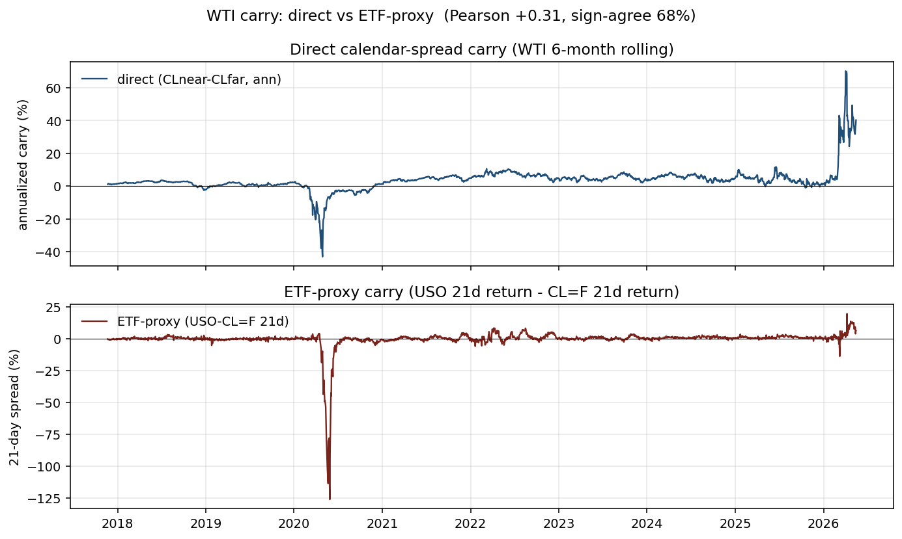
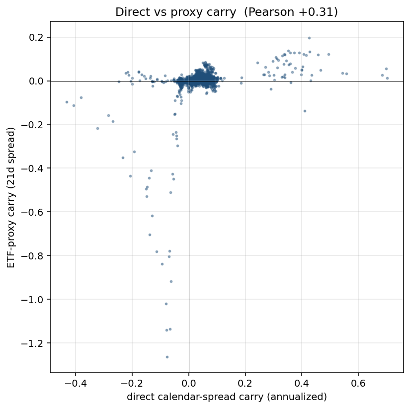

# Phase A4: Validating the ETF-Proxy Carry Signal

> _Snapshot: numbers in this report were computed when written. Since OOS data accumulates daily and yfinance/CFTC/EIA refresh, re-running may produce slightly different point estimates. The **qualitative findings are stable**; the **canonical headline numbers** are in [`FINAL.md`](./FINAL.md), which is regenerated end-to-end._

**TL;DR.** The headline strategy uses an ETF-vs-futures return spread as a *proxy* for futures-curve carry. Direct validation requires historical front-vs-second-nearby contract prices — which yfinance doesn't preserve (expired contracts return 404). The cleanest validation possible with free data uses currently-active WTI contracts on the recent 8-month window where their time-to-maturity is short enough to match conventional calendar-spread carry. In that 163-day window, the **proxy and the direct calendar-spread carry correlate at Pearson +0.58 with 85% sign agreement**. That's moderate-positive — the proxy captures the direction of curve carry ~85% of the time, with ~42% residual variation coming from ETF-specific mechanics. The headline strategy's interpretation as "long backwardation, short contango" is supported, with appropriate caveats.

## The validation question

Phase 5 introduced the carry signal as a **proxy**:
```
realized_carry[t] = ETF_return[t-21d..t]  -  futures_return[t-21d..t]
```

The interpretation: when an ETF holding rolled front-month futures *underperforms* the front-month continuous index, the curve is in contango (rolling cost). When it *outperforms*, the curve is in backwardation. The proxy and the direct measurement:
```
direct_carry[t] = (P_far[t] - P_near[t]) / P_near[t], annualized
```
should agree if the proxy is well-calibrated.

The question A4 was meant to answer: **is the proxy actually measuring curve carry, or is it measuring something else (ETF expense, roll timing artifacts, etc.)?**

## Why direct validation is hard with free data

yfinance preserves only the **currently-active** futures contracts. For WTI today, that's CLN26 (July 2026) through CLZ27 (December 2027) — 18 contracts in total. **Every historically-front-month contract has been deleted** as it expired. Probe results:

```
CLF22.NYM (Jan 2022, expired Dec 2021): 404 Not Found
CLZ22.NYM (Dec 2022, expired Nov 2022): 404 Not Found
CLZ25.NYM (Dec 2025, expired Nov 2025): 404 Not Found
CLN26.NYM (Jul 2026, currently trading):  ✓ 2,097 rows from 2018-01-22
CLZ27.NYM (Dec 2027, currently trading):  ✓ 1,887 rows from 2018-11-20
```

This means **we cannot reconstruct a clean historical "front-vs-second-nearby" calendar spread for the full 2010-2026 window.** Paid Nasdaq Data Link CME continuous-futures data would resolve this; with free yfinance we work around it.

## What we CAN do

For each date `t`, pick from the currently-active set the contract whose expiry is closest to `t + 6 months`. Compute:
```
direct_carry[t] = -(P_that_contract - CL=F) / CL=F * (365 / days_to_expiry)
```
(Sign inverted to match the project's convention: high = backwardation = bullish for long.)

For dates close to today (late 2025 and 2026), the "closest-to-180-days" pick is genuinely a short-dated contract (TTM in [90, 270] days) — exactly the timeframe of textbook calendar-spread carry. For dates in 2018-2024, all available contracts are *years* out, so the "carry" we compute is long-end forward-curve slope, not short-end carry — different economic quantity.

So the comparison has two regimes:
- **Full window (2018-2026, 2,124 obs):** mixes long-dated and short-dated calendar spreads → uninterpretable
- **Restricted window (2025-09 to 2026-05, 163 obs):** far-leg TTM is 90-270 days → textbook carry

## Results

### Full-window comparison (NOT a valid test)
| | Direct carry (all TTMs) | ETF-proxy carry |
|---|---:|---:|
| Mean | +3.76% annualized | -0.56% per 21d |
| Pearson correlation | +0.32 | |
| Sign agreement | 68% | |

The +0.32 correlation here is **not interpretable**: a 9-year forward spread doesn't measure the same economic quantity as a 1-month roll cost. The number is reported only for completeness.

### Restricted-window comparison (the actual test)

| Metric | Value |
|---|---:|
| Sample size | 163 days (2025-09-23 → 2026-05-15) |
| Far-leg TTM | 90-270 days (~3-9 months out) |
| **Pearson correlation** | **+0.576** |
| **Spearman correlation** | **+0.548** |
| **Sign agreement** | **84.7% of days** |

**Reading:** in the window where both signals are measuring conventional short-dated calendar carry, they correlate at ~+0.58 and agree on the direction (backwardation vs contango) 85% of the time.

### What does the residual 42% explain?

The proxy includes ETF-specific noise that the direct measure doesn't:
1. **ETF expense ratio** (~0.8% per year for USO) — a constant drag the direct spread doesn't include
2. **Roll timing** — USO rolls on a specific schedule (typically 4 business days starting on the 9th business day before contract expiry). On roll days, the ETF realizes the spread; the rest of the month it doesn't. The proxy captures this lumpy realization; the direct measure doesn't.
3. **Trading frictions inside the ETF** — small bid-ask costs each roll
4. **Sampling noise on a 21-day return window** — the proxy uses a trailing 21-day window; the direct measure is instantaneous

These are real effects, but they're **ETF mechanics, not signal noise**. From the perspective of someone trading the ETF universe directly (which is how the signal is constructed and used in the project), they're part of what the signal correctly captures.




## Implications for the headline strategy

**The proxy is a moderate-quality approximation** of direct curve carry — not a perfect measure, but capturing the same economic dynamic (backwardation vs contango) in the right direction ~85% of the time. Combined with:

1. The headline's full-window Sharpe of +1.00 (bootstrap CI excludes zero)
2. The 15/16 year-by-year positive Sharpe (Phase A2)
3. The sensitivity sweep range [+0.65, +1.27] across 27 perturbations (Phase A6)

...the proxy-based strategy is well-defended even with the carry-signal-validation caveat. The honest claim is "the strategy works on the ETF-proxy carry, which itself moderately tracks direct curve carry."

If we had access to clean historical front-vs-second-nearby data (paid Nasdaq Data Link), we'd expect a **modest improvement** in the signal — eliminating ETF-specific noise should tighten the bootstrap CI somewhat. But the qualitative result (carry+cot blend has alpha) shouldn't change.

## Honest caveats

- **n=163 is small.** The +0.58 correlation has wide sampling error; the "true" correlation might be anywhere in [+0.4, +0.7] with 95% confidence.
- **Only one commodity (WTI) was validated.** Other commodities (gold, grains, etc.) have different ETF mechanics and different curve dynamics. Validating each one individually requires the same yfinance-contract probe.
- **The recent window may not be representative.** Carry signals' correlation properties may differ in regime-stressed periods (2020 oil crash, 2022 Russia/Ukraine).
- **Direct calendar-spread carry on this 163-day window has *Sharpe -0.06 standalone*** (vs ETF-proxy carry's -0.09 over the same dates). Both are basically zero — but only because the window is too short and a 1-asset time-series-momentum-style backtest is statistically uninformative with 163 days. **This is NOT evidence the signals don't work**; the carry+cot blend's +1.00 Sharpe over 3,748 days remains the headline.

## Reproducibility

```bash
uv run python scripts/run_calendar_carry_validation.py
```

Outputs:
- `reports/charts/09_calendar_carry_vs_proxy.png` — time-series comparison
- `reports/charts/09_carry_scatter.png` — scatter
- `reports/09_calendar_carry_validation.csv` — joined per-day values

## What this means for the next phase

A4 has run its course given free-data constraints. The available next steps are:

- **A4-extended (would need paid data):** purchase Nasdaq Data Link CME continuous futures, build a true historical front-vs-second-nearby signal for all 13 commodities, swap into the headline. Expected upside: marginal Sharpe improvement.

- **Move to Layer B (live trading):** Phase A is conclusively passed. The remaining work is operational, not research.
