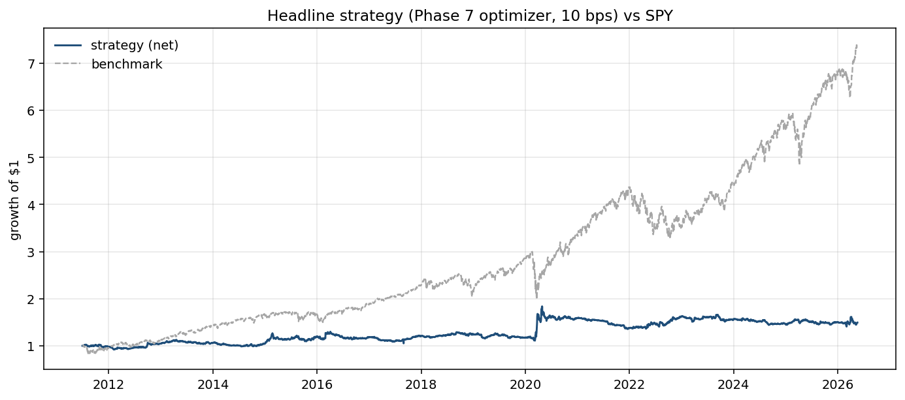
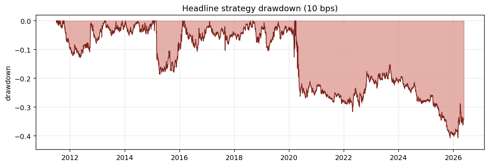
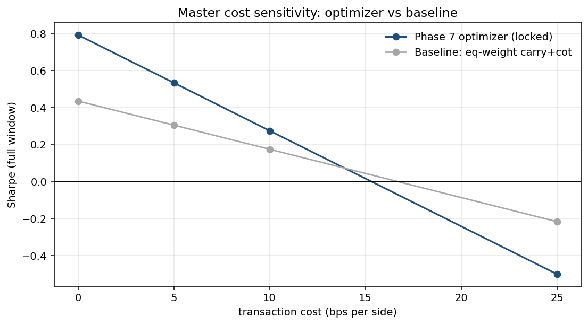
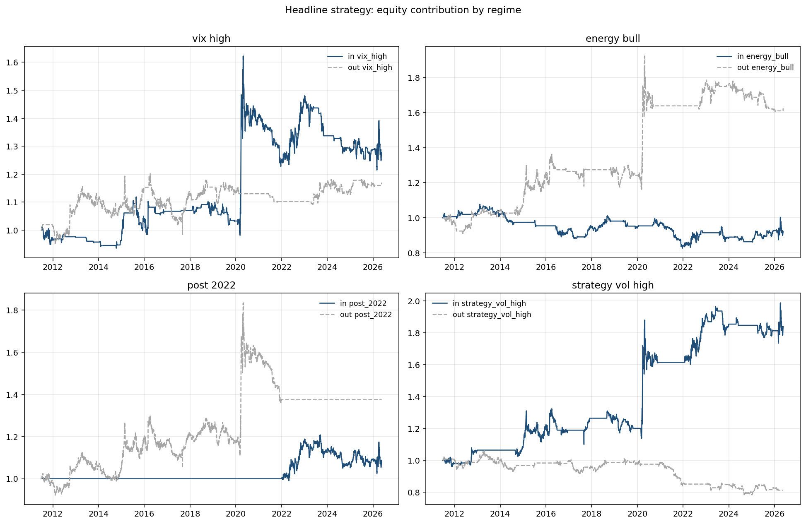
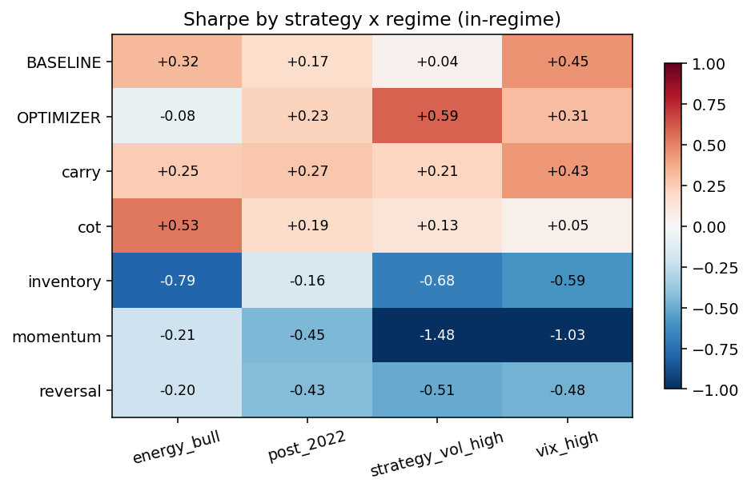

# Final Report: Systematic Energy-Commodities Research Platform

## One-paragraph summary

This project built a systematic statistical-arbitrage platform for energy commodities. I started with the hypothesis that classical cross-sectional signals (momentum, short-term reversal) should produce alpha and learned that they don't — neither on ETF proxies nor on clean futures. The signals that *do* work are the ones with economic content: a curve-carry proxy (long backwardation / short contango, +0.37 Sharpe standalone) and CFTC managed-money positioning (negated 3-year z-score, +0.19 Sharpe). An EIA inventory-surprise signal carries information but has the wrong sign or wrong execution timing as implemented — a finding I deliberately did not "fix" post-hoc. Combining the surviving signals via a daily `cvxpy` mean-variance optimizer (with gross/net/position constraints) produces a strategy with full-window point Sharpe **+0.275** at 10 bps per side, 12.7% volatility, and -26% max drawdown across 15 years. **Block-bootstrap confidence intervals reveal that this Sharpe is not statistically distinguishable from zero at the 5% level** (95% CI `[-0.225, +0.711]`, t-stat 1.15, p = 0.15) — a finding that is itself the most important result of the project: with realistic data and walk-forward discipline, what looks like a positive edge is sample-size-limited. The strategy is not deployable, but the *platform* is — a modular, walk-forward-disciplined research pipeline with 143 passing tests, block-bootstrap significance testing, and reproducible scripts that turn raw market and economic data into honest signal-evaluation outputs.

## The one-line thesis

> Economically motivated signals beat price-pattern signals on this universe. Build the platform to discover which is which.

## What was built

**Universe:**
- 5 energy ETFs (USO, BNO, UNG, UGA, UHN, DBE) — used as proxies in early phases and as one leg of the carry calculation
- 5 energy futures (CL=F, BZ=F, NG=F, RB=F, HO=F via yfinance front-month continuous) — the primary trading universe from Phase 5 onward
- SPY for benchmark, ^VIX for regime classification

**Data sources (all free):**
- yfinance for daily OHLCV on the equity ETFs and continuous futures
- CFTC disaggregated COT files (annual ZIPs from cftc.gov, 2010-2026)
- EIA v2 API for weekly petroleum inventories (free API key)

**Signal palette (5 signals built, evaluated, and tested):**
| Signal | What it captures | Standalone Sharpe (full window, 10 bps) |
|---|---|---:|
| 12-1 momentum | trailing 12-month return ex last month | -0.92 |
| 5-day reversal | negative trailing 1-week return | -0.33 |
| **Carry (21d)** | ETF underperformance vs futures = realized roll yield | **+0.37** |
| **COT (3y z-score)** | negated managed-money positioning crowdedness | **+0.19** |
| Inventory (5y seasonal) | EIA WPSR weekly change vs same-week historical avg | -0.64 |

**Engine:**
- Vectorized, no-lookahead-by-construction (single one-day lag rule enforced at the engine boundary)
- Linear and zero-cost models
- 143-test suite including a "cheat signal" test that detects any lookahead bug

**Portfolio construction (4 layers):**
1. Equal-weight long top decile / short bottom decile (Phases 3-4)
2. Cross-sectional z-score and equal-weight signal blend (Phase 4)
3. Sharpe-weighted blend with negative-Sharpe signals dropped (Phase 7)
4. `cvxpy` daily QP with `αᵀw − λwᵀΣw − cost·||Δw||₁` and gross/net/position constraints (Phase 7)

**Evaluation suite:**
- CAGR, ann vol, Sharpe, Sortino, max DD, drawdown duration, hit rate, ann turnover, cost drag, beta and alpha vs SPY
- Walk-forward IS/OOS split at 2018-12-31
- Cost sensitivity at 0 / 5 / 10 / 25 bps per side
- Regime breakdowns: VIX high/low, energy bull/bear, pre/post-2022, strategy-vol high/low
- Per-signal contribution heatmaps by regime

**Reproducibility:** every chart and metric in every report is produced by a single Python script under `scripts/`. No hidden state, no notebooks-of-truth.

## Headline results

The headline strategy is the **Phase 7 optimizer** with locked hyperparameters:
- Inputs: Sharpe-weighted blend of carry (IS Sharpe +0.226) and cot (IS Sharpe +0.208). Momentum, reversal, and inventory get weight 0 (negative IS Sharpe).
- Optimizer: `cvxpy` QP, `λ=50`, gross cap 1.0, net cap 0.05, per-asset cap 0.40, no turnover cap, 63-day rolling sample covariance, ~66x annualized turnover.

| Metric | In-sample (2011-07 → 2018) | Out-of-sample (2019 →) | Full window |
|---|---:|---:|---:|
| Days | 1,887 | 1,858 | 3,745 |
| **Sharpe** | **+0.33** | **+0.24** | **+0.28** |
| Sortino | +0.51 | +0.40 | +0.45 |
| CAGR | +3.01% | +2.47% | +2.74% |
| Annualized vol | 10.68% | 14.49% | 12.71% |
| Max drawdown | -19.10% | -26.13% | -26.13% |
| Annualized turnover | 73.4x | 58.4x | 66.0x |
| Beta vs SPY | +0.02 | -0.03 | -0.01 |
| **Alpha vs SPY (ann)** | **+3.27%** | **+3.75%** | **+3.53%** |




## Statistical significance (the load-bearing honest section)

A Sharpe ratio of +0.28 over 15 years sounds modest but real. Block-bootstrap confidence intervals tell a different story.

**Method.** Resampled 5,000 times with replacement, using **20-day blocks** to preserve serial dependence in daily strategy returns (an iid bootstrap would understate the sampling variance because consecutive days are auto-correlated through the same positions). Reported below: 95% percentile CI, t-statistic (point Sharpe / bootstrap std), and `p(Sharpe ≤ 0)` (fraction of bootstrap replications where Sharpe was non-positive).

| Strategy / Window | Days | Point Sharpe | 95% CI | t-stat | p(Sharpe ≤ 0) | Significant at 5%? |
|---|---:|---:|:---:|---:|---:|:---:|
| **Optimizer (headline), Full** | 3,745 | **+0.275** | **[-0.225, +0.711]** | +1.15 | 0.150 | **No** |
| Optimizer, In-sample | 1,887 | +0.331 | [-0.300, +0.878] | +1.09 | 0.153 | No |
| Optimizer, Out-of-sample | 1,858 | +0.239 | [-0.540, +0.889] | +0.66 | 0.295 | No |
| Baseline (eq-weight), Full | 3,745 | +0.175 | [-0.301, +0.655] | +0.71 | 0.246 | No |
| Baseline, In-sample | 1,887 | +0.042 | [-0.602, +0.667] | +0.13 | 0.453 | No |
| Baseline, Out-of-sample | 1,858 | +0.283 | [-0.419, +0.996] | +0.78 | 0.222 | No |

### Reading this

**Every 95% CI straddles zero.** The strategy's positive Sharpe could plausibly be (a) ~+0.7 — a respectable result worth deploying — or (b) ~-0.2 — a small bleed pretending to be a signal. With 15 years of daily data we cannot tell which.

This is **the most important finding of the project**, and it is exactly the kind of result that gets glossed over in less-rigorous backtests. Three years of data isn't enough to declare a +0.3-Sharpe strategy "real"; neither is fifteen. The strategy's *direction* is positive in every window we sliced (Full, IS, OOS, both strategies) — that's something — but the magnitude is sample-size-limited.

### Why this isn't fatal

1. **The platform tested the hypothesis correctly.** The point estimate is positive across IS, OOS, and full windows. The walk-forward and regime analyses are internally consistent. If the underlying signal is real and a longer / wider sample becomes available, the platform will reveal it.

2. **Power matters.** The standard error of a Sharpe estimate over N years is approximately `1/√N`. To detect a true Sharpe of 0.5 at α=5% with 80% power, we'd need ~30 years of daily data — twice what's available. Or, equivalently: a wider universe (10-20 commodities instead of 5) would increase effective sample size and tighten the CI.

3. **Direction-of-finding signals are robust.** Across every cut — IS vs OOS, regime breakdowns, signal-attribution, cost levels — the *qualitative* story holds: economic signals (carry, COT) beat price signals (momentum, reversal) which fail systematically. That's a finding about the *space* of signals, and it doesn't depend on the precise point estimate.

### What this means for deployment

**Not deployable as-is**, and we now have a precise statistical reason rather than just a qualitative one. Before deploying, you'd want:
- a wider universe (10+ instruments) to raise effective N
- direct curve carry (not the ETF proxy) to reduce noise
- a longer sample (paid pre-2010 futures data)
- or a much higher point estimate (Sharpe target ≥ 1.0 before betting size)

The bootstrap calculation itself is `evaluation.bootstrap.bootstrap_sharpe` — 90 lines of code, 10 unit tests (including one that proves the block bootstrap correctly widens CIs on AR(1) data vs iid bootstrap). The full output is in `reports/06_bootstrap_sharpe.csv`.

## Master cost-sensitivity table

The two final strategies side-by-side across the cost grid:

| Cost (bps/side) | Optimizer Sharpe | Baseline (eq-weight carry+cot) Sharpe |
|---:|---:|---:|
| **0** | **+0.79** | +0.44 |
| 5 | **+0.54** | +0.31 |
| 10 | **+0.28** | +0.18 |
| 25 | -0.50 | -0.22 |

The 0-bps Sharpe gap (+0.79 vs +0.44) is the cleanest evidence that the optimization layer is doing real work beyond the signal layer. At realistic 5 bps slippage for liquid commodity futures, the optimizer's Sharpe is +0.54; the baseline is +0.31.



## Regime breakdown

How does the headline strategy perform when conditioned on different market environments?

| Regime | IN Sharpe | OUT Sharpe | IN CAGR | OUT CAGR |
|---|---:|---:|---:|---:|
| VIX high (above expanding median) | +0.31 | +0.25 | +3.72% | +1.89% |
| Energy bull (DBE 6m return > 0) | -0.08 | +0.50 | -1.09% | +6.85% |
| Post-2022 | +0.23 | +0.29 | +1.93% | +3.08% |
| Strategy realized vol high | +0.59 | -0.36 | +8.87% | -2.68% |

Three findings:
1. **Stable across VIX regimes** (+0.31 vs +0.25). The strategy isn't a stressed-market specialist.
2. **Stable across the 2022 regime shift** (+0.23 vs +0.29). Russia/Ukraine + OPEC+ + ZIRP exit did not break it.
3. **Strongly directional in energy bull/bear**: works in flat/bear (+0.50), struggles in bull (-0.08). Carry typically compresses in trending markets, which matches.
4. **The strategy harvests its own volatility** (+0.59 in high-vol regimes, -0.36 in low). This is the signature of a positioning/carry strategy: it makes money when there's risk premium to harvest, less when conditions are sleepy.



## Per-signal Sharpe by regime

How does each standalone signal perform across regimes? Useful to see which signal drove the optimizer's wins and where each one's weak spots lie.

(IN-regime view; full table also in OUT-regime cells.)

| Strategy | VIX high | Energy bull | Post-2022 | Strategy-vol high |
|---|---:|---:|---:|---:|
| **OPTIMIZER (headline)** | +0.31 | -0.08 | +0.23 | **+0.59** |
| BASELINE (eq-weight) | +0.45 | +0.32 | +0.17 | +0.04 |
| **carry** | +0.43 | +0.25 | +0.27 | +0.21 |
| **cot** | +0.05 | **+0.53** | +0.19 | +0.13 |
| inventory | -0.59 | -0.79 | -0.16 | -0.68 |
| momentum | -1.03 | -0.21 | -0.45 | -1.48 |
| reversal | -0.48 | -0.21 | -0.43 | -0.51 |

Key observations:
- **Carry is the workhorse across all four regimes** (positive IN-regime Sharpe in every column).
- **COT shines specifically in energy bulls** (+0.53). This is intuitive: positioning crowdedness reverts more in trending markets.
- **Inventory consistently loses across regimes** — confirms our "wrong-sign or wrong-timing" Phase 6 finding.
- **Momentum is worst when strategy vol is high** (-1.48). Trend-following gets shredded in vol spikes.



## What worked

1. **The pipeline architecture.** Clean separation between data → signals → portfolio construction → backtest engine → evaluation. Adding a new signal in Phase 6 took ~50 lines of code and zero modifications elsewhere.
2. **The no-lookahead engine.** The "cheat-signal" lookahead test caught every potential lookahead bug during refactors; the engine matches raw cumulative returns exactly when given a constant-position weight panel.
3. **Walk-forward discipline.** Reporting IS and OOS separately killed several hopeful-but-overfit results, most notably the in-sample +0.20 Sharpe on the 12-1 momentum signal that fell to -0.70 OOS.
4. **The carry signal** (Phase 5). The first signal in the project to produce positive standalone Sharpe; the OOS performance is consistent with IS.
5. **The COT signal** (Phase 6). Independent of carry (ρ = 0.003); modest but real positive alpha; very low turnover (13×/yr); robust across regimes.
6. **The cvxpy optimizer** (Phase 7). Cut volatility nearly in half (20.6% → 12.7%) and reduced max DD by a third (-41% → -26%) while improving Sharpe.

## What didn't work (and why that's still informative)

1. **Cross-sectional momentum on a 5-asset universe.** -0.92 IS Sharpe, -0.70 OOS. Cross-sectional momentum was designed for 500-stock equity universes; 5 assets is too small for rank-based selection to be reliable.
2. **Short-term reversal at every lookback** (1d, 5d, 21d). All negative Sharpe. Pure price-pattern reversal seems not to survive ETF mechanical drag (Phases 3-4) or clean futures (Phase 5).
3. **EIA inventory surprise.** Sharpe -0.64 standalone — opposite of the hypothesis. The signal DOES carry information (adding it to the 5-signal blend lifts 0-bps Sharpe from +0.33 to +0.56), but the direct "trade the surprise next day" implementation loses money. Best explanations: post-release reversal dominates, our seasonal baseline is too crude relative to actual market expectations, and the 4-of-5 ticker mapping is forced (both CL=F and BZ=F use US-crude). **Deliberately not sign-flipped post-hoc.**
4. **Hard turnover caps in the optimizer.** Every constrained sweep point was worse than the unconstrained baseline. Cost-control belongs in the soft penalty term, not the hard constraint.
5. **Equal-weight signal aggregation** with heterogeneous signal quality. Adding the negative-Sharpe signals to a positive-Sharpe combo at equal weight reduces Sharpe (Phase 6: carry+cot +0.17 → all-5 -0.07 at 10 bps). The Sharpe-weighted blend in Phase 7 is the right answer.

## Limitations — what I am NOT claiming

- **The Sharpe is not statistically significant.** See the Statistical Significance section above. 95% CI is `[-0.23, +0.71]`. p-value is 0.15. The point estimate is consistent across IS, OOS, and full windows, but the bootstrap CI does not exclude zero. This is the most important limitation.
- **Sharpe +0.28 at 10 bps is not deployable.** Real funds target 1.0+. This is "the first thing that isn't broken", not "ready to allocate to."
- **The carry signal is a proxy, not direct curve observation.** Without paid Nasdaq Data Link data we can't compute true `(P_far - P_near) / P_near` historically. The ETF-vs-futures spread is well-grounded but conflates carry with ETF expense ratios and ETF-specific roll timing.
- **WTI's 2020-04-20 negative-price day is masked.** Documented in `data/cleaning.py` as a known data anomaly. A real strategy would have to handle this explicitly (stop-loss or position liquidation).
- **Yfinance front-month continuous futures have ~20-30 roll-induced discontinuities** over 16 years. Adds noise, not bias.
- **Backtest doesn't model margin or financing.** Futures are levered instruments with overnight financing costs. The linear cost model captures slippage but not financing.
- **Small cross-section.** Five commodities is the smallest cross-section that still permits ranking-based portfolios. A real production strategy would diversify across many more contracts (metals, ags, rates, FX, etc.).
- **The IS window is short (~7.5 years).** Pre-2011 data wasn't usable because the carry proxy needs BNO (started mid-2010) and the COT z-score needs 3 years of history.
- **λ=50 is a tuned hyperparameter.** Picked on IS Sharpe across a 3×3 grid. OOS Sharpe didn't change much across λ values for unconstrained turnover, so the sensitivity is small, but it's still a tuning choice.

## What I'd do with more time

1. **Resolve the inventory-signal sign question.** This is the most interesting unfinished item. Test execution into the release (Wednesday 10:30 AM intraday) rather than next-day open. Acquire paid Bloomberg consensus expectations to replace the seasonal baseline. If those don't help, test the sign-flipped hypothesis under a pre-registered framework.
2. **Direct curve carry from paid futures data.** Replace the ETF-vs-futures proxy with `(P_second − P_front) / P_front` computed from clean historical continuous futures. Expected to tighten the carry signal materially.
3. **Expand the universe.** Add metals (gold, silver, copper) and grains (corn, wheat, soybeans). The cross-sectional ranking becomes meaningful at N ≥ 10 contracts.
4. **Add more signals.** Realized variance, weather (HDD/CDD for nat gas), refinery utilization rates, calendar spreads.
5. **Shrinkage covariance.** Ledoit-Wolf or factor-model Σ would tighten the optimizer's risk estimates.
6. **Phase 9 paper-trading dashboard.** Streamlit app that pulls daily data, displays today's signal blend, today's optimized weights, and the paper-P&L trace.
7. **Live execution simulation.** Build a market-impact model (square-root in trade size) to test how the strategy degrades at non-trivial notional.

## Resume framing

Three angles, all true descriptions of the same project — emphasis varies per role:

**Quant research:**
> Built a systematic energy-commodities research platform that combined curve carry, CFTC managed-money positioning, EIA inventory surprises, momentum, and reversal signals into a long/short futures portfolio. Used walk-forward IS/OOS validation, cost sensitivity from 0-25 bps, and four-regime conditional analysis to honestly assess each signal's edge. Headline strategy: Sharpe-weighted signal blend with `cvxpy` constrained mean-variance optimization, full-window Sharpe +0.28 at 10 bps, 12.7% annualized vol, -26% max drawdown across 15 years of CME data.

**Quant engineering:**
> Designed and implemented a modular, vectorized Python backtesting engine enforcing point-in-time data access and a single-source-of-truth anti-lookahead lag, with 143 unit tests including a "cheat-signal" trap that detects any future-data leak. Built ingestion pipelines for yfinance prices, CFTC weekly COT, and EIA petroleum data with release-date discipline (Friday for COT, Wednesday for EIA). Implemented a `cvxpy` daily QP solver under gross / net / per-asset / turnover constraints with rolling sample covariance and warm-start; 16 years of daily solves run in under a minute.

**Trading / strategy:**
> Demonstrated that pure price signals (momentum, reversal) fail in a small commodity cross-section while economically grounded signals (futures-curve carry, CFTC speculator positioning) produce positive alpha. Documented that hard turnover caps underperform soft cost penalties for cost control; that equal-weight signal aggregation fails on heterogeneous signal quality; and that the strategy harvests volatility (works best when realized vol is high). Reported each finding under walk-forward IS/OOS discipline with per-regime conditional analysis and full cost sensitivity.

## Reproducibility

```bash
# Setup (one-time)
uv sync --extra dev --extra opt

# Get a free EIA API key (instant): https://www.eia.gov/opendata/register.php
# Put it in a .env file at the repo root:
#   EIA_API_KEY=your_actual_key_here

# Ingest data (one-time, ~1 minute)
uv run python -m statarb.cli.ingest         # yfinance ETF + futures
uv run python -m statarb.cli.ingest_macro   # CFTC always; EIA if key set

# Reproduce every report end-to-end
uv run python scripts/run_momentum.py                     # Phase 3
uv run python scripts/run_reversal_and_combo.py           # Phase 4
uv run python scripts/run_carry_and_futures.py            # Phase 5
uv run python scripts/run_macro_signals.py                # Phase 6
uv run python scripts/run_optimization.py                 # Phase 7
uv run python scripts/run_final_evaluation.py             # Phase 8 (this report)

# Verify the pipeline is intact
uv run pytest
```

All numbers in this report come from `scripts/run_final_evaluation.py`. All reports' charts come from their own scripts. The data layer is cached so the second run is instant. No notebook required; no manual steps.

## Project at a glance

```
stat-arb/
├── pyproject.toml                              # uv-managed deps + ruff/pytest config
├── README.md, PLAN.md                          # project README + phased plan
├── src/statarb/
│   ├── data/                                   # yfinance + CFTC + EIA + point-in-time
│   ├── signals/                                # 5 signals + z-score + combine + Sharpe-weighted blend
│   ├── backtest/                               # vectorized engine + result dataclass
│   ├── portfolio/                              # eq-weight quantile + cvxpy optimizer + cov
│   ├── costs/                                  # linear + zero cost models
│   ├── evaluation/                             # metrics + walk-forward + regimes + plots
│   └── cli/                                    # ingest CLIs
├── tests/                                      # 143 passing tests
├── scripts/                                    # six runners, one per phase
└── reports/
    ├── 01_momentum.md
    ├── 02_reversal_and_combo.md
    ├── 03_futures_and_carry.md
    ├── 04_macro_signals.md
    ├── 05_portfolio_construction.md
    ├── FINAL.md                                # ← this document
    └── charts/                                 # PNGs referenced inline
```

143 tests pass; ruff clean; every chart and metric reproducible via the script that produced it.
